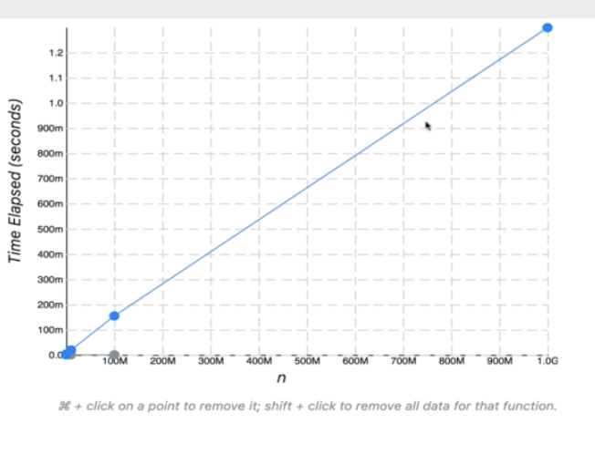
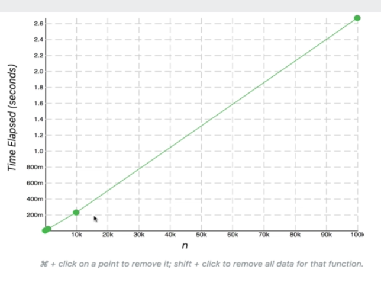
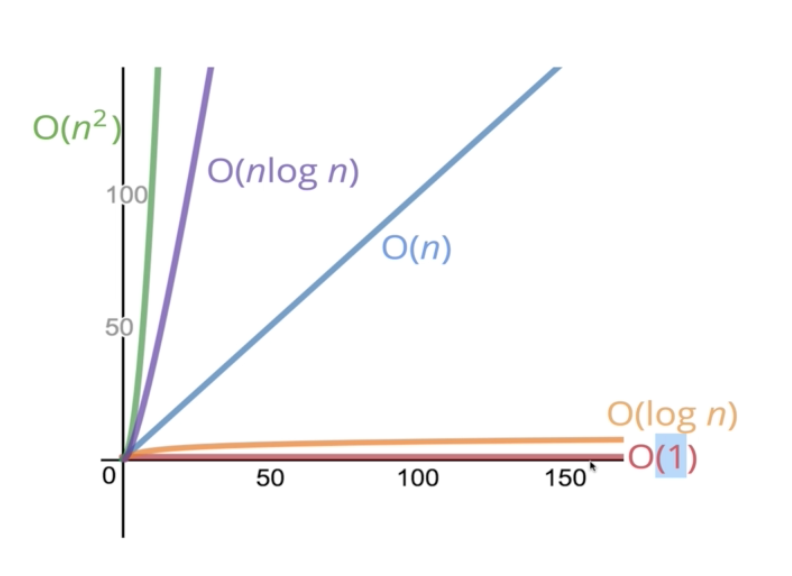
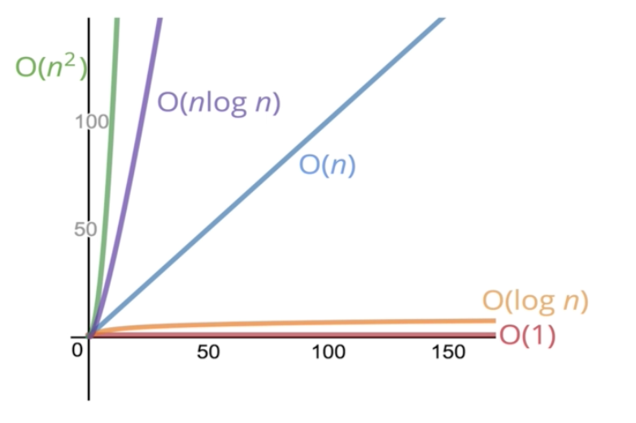

###### What's the idea here?

- Imagine we have multiple implementations of the same function
- They are different and totally different in approaches
- Which one is `best`?
- This is what Big O is about
- Comparing the performances of pieces of code to other pieces of code

Example

`Which a function that accepts a string input and returns a reversed copy`

- This sort of problem has a lot of different solutions

###### Who Cares?
- It's important to have a precise vocabulary to talk about how our code performs
- Useful for discussing trade-offs between different approaches
- When your code slows down or crashes, identifying parts of the code that are inefficient can helpus find pain points in our applications
- It comes up in interviews

###### An Example

```
Suppose we want to write a function that calculates the sum of all numbers from 1 up to (and including) some number n
```

Solution 1
```
function addUpTo(N) {
    let total = 0
    for (let i = 1; i <= n; i++) {
        total += i
    }
    return total
}
```

Solution 2
```
function addUpTo(n) {
    return n * ( n + 1) / 2
}
```

- Which one is better?

###### What does better mean?

- Faster in time? Faster with larger vs smaller numbers?
- Less memory-intensive?
- More readable?

- People usually mean faster or less memory-intensive
- Usually these two come at the expense of readability
- It's a balancing act between writing fast and efficient code and making it readable

- We are going to focus on `speed` - how long it takes the code to execute
- Manually timing the executions of the code to check its performance is not a good solution

###### The Problem with Time

- Different machines will record different times
- The *same* machine will record different times
- For fast algorithms, speed measurements may not be precise enough

###### If not time, then what?

- Rather than counting *seconds* which are so variable, let's count the *number* of simple operations the computer has to perform
    * This is always the same between machines

###### Counting Operations

```
function addUpTo(n) {
    return n * ( n + 1) / 2
}
```

- 3 operations here - multiplication, addition, and divison
- It doesn't really matter what n is - only 3 calculations ever happen

```
function addUpTo(N) {
    let total = 0
    for (let i = 1; i <= n; i++) {
        total += i
    }
    return total
}
```

- This one has more
- operations here - if n = 5 here, we are adding 5 different times (total += i), so that's 5 operations
    * If n is 20, we have to do addition 20 times
    * and so on
- We have n operations - we have *n* additions and *n* assignments
    * n additions and n assignments for `i++` - happens more as n grows
    * If n is 10, we have 10 additions and 10 assignments here
    * `let total = 0` is 1 assignment - happens 1 time at the beginning
    * `let i = 1` is 1 assignment - happens 1 time at beginning
    * `i <= n` is `n` comparisons
        - If n = 20, we compare i to n 20 times - so that's 20 operations
- How many operations do we have here? How do we count them?

###### Counting is Hard

- It could be as high as `5n + 2` or as low as `2n` (this is based on above example)
- But regardless of the exact number, the number of operations grows roughly *proportionally with n*


#### Visualizing Time Complexities



- The blue line is addUpTo with the for loop
- The gray line is addUpTo with the summation formula

- Notice that time grows linearly for the blue line
- For the gray line, time is constant for any number of *n*

#### Official Intro to Big O

- Big O Notation is a way to formalize fuzzy counting
- Allows us to talk formally about how the runtime of an algorithm grows as the inputs grow
    * Relationship between the input size to a function and the time relative to that input
- Only care about the broad trends, not the details

- We say that an algorithm is **O(f(n))** if the number of simple operations the computer has to do is eventually less than a constant times **f(n)**, as **n** increases
f(n) could be linear (f(n) = n) - n is the input to function f() and n is the output
f(n) could be quadratic (f(n) = n^2)
f(n) could be constant (f(n) = 1)
f(n) could be something entirely different

- `When we talk about Big O, we are talking about the worst case scenario`
- The upper bound for runtime

- addUpTo with formula for summation of n - has a Big O of O(1)
    * Because we always have 3 operations no matter what the input, *n*, is
    * As n grows, it is not reflected in the runtime
- addUpTo with the for loop
    * The runtime grows as n grows basically at a 1-to-1 ratio, then we say that the Big O is O(n)
        - 5n and n is the same in a fuzzy way

Another example

```
function countUpAndDown(n) {
    console.log("Going up")
    for (let i = 0; i < n; i++) {
        console.log(i)
    }
    console.log("At top, going down")
    for (let j = n - 1; j >= 0; j--) {
        console.log(j)
    }
    console.log("Back down, bye")
}
```

- Big O for this function
- First for loop, have a Big O of O(n) 
- Second for loop, have a Big O of O(n)
- Big O = O(2n) = O(n)



Another example

```
function printAllPairs(n) {
    for (var i = 0; i < n; i++) {
        for (var j = 0; j < n; j++) {
            console.log(i, j)
        }
    }
}
```

- Nested for loop
- First loop is O(n)
- Nested loop is O(n)
- This is not O(2n) because it is nested
- This is actually O(n * n) = O(n^2)
- Let's think about it - if n = 2, you get the 4 pairs - [0, 0] [0, 1], [1, 0], and [1, 1]
    - For n = 3, you get 9 pairs



#### Simplifying Big O Expressions

- When determining the time complexity of an algorithm, there are some help rules of thumb for big O expressions

- Constants don't matter
    * O(2n) = O(n)
    * O(500) = O(1)
    * O(13n^2) = O(n^2)

- Smaller terms don't matter
    * O(n + 10) = O(n)
    * O(1000n + 50) = O(n)
    * O(n^2 + 5n + 8) = O(n^2)

###### Big O Shorthands

- Analyzing complexity with Big O can get complicated
- Several rules of thumb that can help
- These rules won't **ALWAYS** work, but are a helpful starting point

1. Arithmetic operations are constant
2. Variable assignment is also constant
3. Accessing elements in an array (by index) or object (by key) is constant
4. In a loop, the complexity is the length of the loop times the complexity of whatever happens inside of the loop

###### A Couple More Examples

```
function logAtLeast5(n) {
    for (var i = 1; i <= Math.max(5, n); i++) {
        console.log(i)
    }
}
```

- Loop goes to either 5 or n, whichever is bigger
- As n grows to infinity, what happens to the runtime? The 5 won't matter
- The runtime is O(n)

```
function logAtLeast5(n) {
    for (var i = 1; i <= Math.min(5, n); i++) {
        console.log(i)
    }
}
```

- Runs at most 5 times
- Runtime is O(1) - as n grows, it doesn't matter - the loop will run 5 times


#### Space Complexity

- We can also use Big O notation to analyze **space complexity**
    * How much additional memory do we need to allocate in order to run the code in our algorithm?

###### What about inputs?

- Will ignore the size of n (the input to the function) right now
- Sometimes you'll hear the term **auxiliary space complexity** to refer to space required by the algorithm, not including spcae taken up by the inputs
    * This is what this is section is talking about

- As n grows, we are assuming that the input (n) grows as well
- Technically talking about auxiliary space complexity

###### Space Complexity in JS

Rules of Thumb
- Most primitives - booleans, numbers, undefined, null - are constant space
- String require O(n) space (where *n* is the string length)
    * If a string is 50 characters it takes up 50 times more space than a single character
- Reference types (arrays and objects) are generally O(n) where n is the length (for arrays) or the number of keys (for objects)
    * If array X is length 4 and array Y is length 2, array X takes up twice as much space

###### An example

```
function sum(arr) {
    let total = 0
    for (let i = 0; i < arr.length; i++) {
        total += arr[i]
    }
    return total
}
```

- Space complexity here will be `O(1)`
    * No matter what the length of arr is, we have a number `total`
    * We also have another number `i`
- No matter what the size of `arr` is - `total` and `i` don't take up anymore space
    * They exist no matter

###### Another Example

```
function double(arr) {
    let newArr = []
    for (let i = 0; i < arr.length; i++) {
        newArr.push(2 * arr[i])
    }
    return newArr
}
```

- Space complexity is O(n)
- As `arr` approaches infinity, what happens to the space?
    * newArr in direct proportion to the the input
        - If `arr= 10`, `newArr=10`

#### Logarithms

- Some Big O expressions involve more complex mathematical expressions
- One that appears is the logarithm
    * O(Log(n))

###### Wait, what's a log again?

- A logarithm is the opposite of an exponentiation
log<sub>2</sub>(8) = 3 - log base 2 of 8 = 3
- 2^? = 8 -> 2<sup>3</sup>=3

- For us, going to say that `log === log<sub>2</sub>

- `Logarithmic time complexity is great`
- O(nLogn) is common as well

###### Who cares?

- Certain searchin algorithms have logarthmic time complexity
- Efficient sorting algorithms involve logarithms
- Recursion sometimes involves logarithmic space complexity



```
The time or space complexity (as measured by Big O) depends only n the algorithm, not the hardware used to run the algorithm 