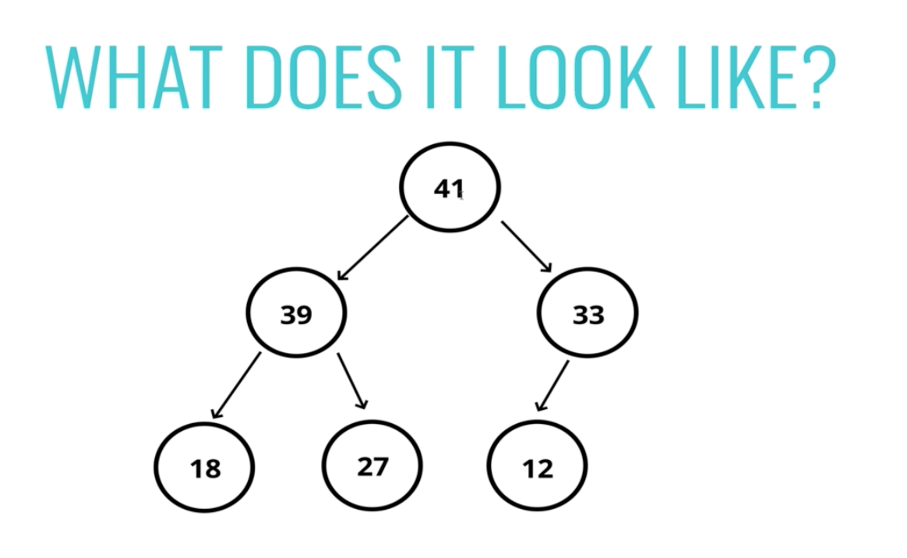
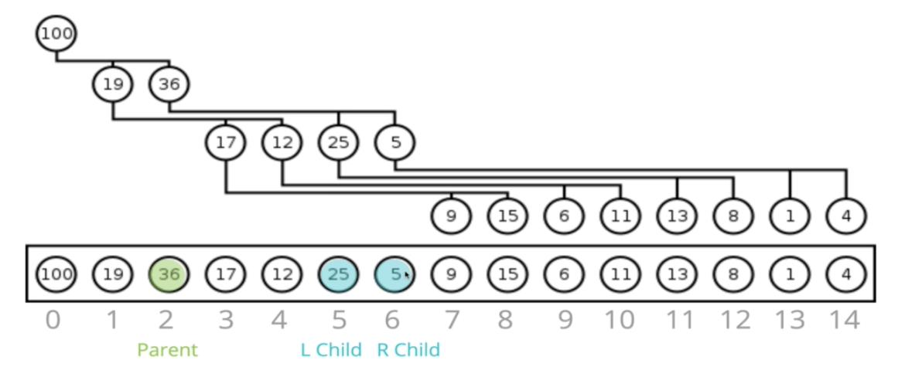

#### Intro to Heaps

- Heaps are a category of trees
- Two types of heaps we will focus on - min and max heaps

###### What Is A Binary Heap?

- Very similar to BST but with some different rules

- In a **MaxBinaryHeap**, parent nodes are always larger than child nodes
- In a **MinBinaryHeap**, parent nodes are always smaller than child nodes
- Left child does not need to be smaller than the right child

###### Max Binary Heap

- Each parent has at most two child nodes
- The value of each parent is **always** greater than its child nodes
- In a max Binary Heap the parent is greater than the children, but there are no guarantees between sibling nodes
- A binary heap is as compact as possible
    * All the children of each node are as full as they can be and left children are filled out first

###### Why do we need to know this?

- Binary Heaps are used to implement `Priority Queues`, which are **very** commonly used data structures
- Also used quite a bit with `Graph Traversal` algorithms

#### Sorting Heaps

- There's an easy way of sorting a binary heap
- A list/array

**To find a child based off its parent**

- For any index of an array *n*
    * The left child is stored at *2n+1*
    * The right child is at *2n+2*

**To find a parents based off its child**

- Parents is at index (n-1)/2 floored

#### Insert Intro

###### Defining Our Class

- Just need a class with an empty array to start

###### Adding to a MaxBinaryHeap

- Add to the end just by pushing it to the end of the array
- Bubble up
    * Swap it until it finds its final correct resting place
    * In a max binary heap, the larger values are going to bubble up to the correct spot

Example

- Bubble up 55, compare it to its parent and swap

- Compare it to its parent again and swap them

- Now we satisfy the condition that every child node must be less than its parent

*Insert Pseudocode*

- Push the value into the values property on the heap
- Bubble the value up to its correct spot
    * Create a variable called index which is the length of the propertys - 1
    * Create a varaible called parentIndex which is the floor of (index-1)/2
    * Keep looping as long as the values element at the parentIndex is less than the values element at the child index
        - Swap the value of the values element at the parentIndex with the value of the element property at the child index
        - Set the idnex to be the parentIndex, and start over

#### Removing From A Heap

- Remove the root
- Replace with the most recently added
- Adjust (sink down)

- The one area we usually remove from is the root
    * This is common because a priority queue takes out this value

- Common way of doing it is using the last value and putting it at the root and then adjusting 

###### Sink Down

- The procedure for deleting the root from the heap (effectively extracting the max element in a max-heap or the minimum element in a min-heap) and restoring the properties is called *down-heap*

- Compare 12 to 39 and 33, both are larger but 39 is the largest
    * So we switch 39 and 12

- 12 switches with 39
- Now we need to compare it to both new children and swap it with the larger one if one of them is larger
    * If both of them are smaller than it is in the correct spot and we don't need to swap    

- 12 has sunk down to its correct spot

*Removing Pseudocode*

- Swap the first value in th values property with the last one
- Pop from the values property, so you can return the value at the end
- Have the new root "sink down" to the correct spot
    * Your parent index starts at 0 (the root)
    * Find the index of the left child: `2*index+1` (make sure it's not out of bounds)
    * Find the index of the right child: `2*index+2` (make sure it's not out of bounds)
    * If the left or right child is greater than the element, swap
        - If both left and right children are larger, swap with the largest child
    * The child index you swapped to now becomes the new parent index
    * Keep looping and swapping until neither child is larger than the element
    * Return the old root

#### Priority Queue Intro

- A data structure whre each element has a priority
- Elements with higher priorities are served before elements with lower priorities

###### What is a Priority Queue?

- In above screenshot (this is for unix systems), the item second the left is called `nice` but it is a priority level - the higher the number, the lower the priority
- Oftentimes a lower number actually denotes a higher priority

- Priority Queues are separate from heaps
- They are just an abstract concept
- You could implement a priority queue with an array or a list
    * It's slow but possible
    * It's the same as the idea of a *list*, you could have a list implemented as an array, SLL, etc

###### Naive Version

- Use a list (in this case an array) to store all elements
- When it's time to serve the next item, you would just iterate over the entire thing and just check what's the highest priority
- Not a great approach b/c every single time we need to search something new

###### Hospital Room Example

- Before person can be helped, person w/ concussion walks in
    * That is a higher priority element or value

- Person with concussion is next to get help

- Another person walks in but they are lower priority than a person with a concussion

- New person walks in with the new highest priority
    * Remember it starts at the end and bubbles it up

- Root gets help so the person at the end is put at the root and sunk down to it's correct location

- `A heap works really well b/c insertion and removal have a time complexity of O(logn)`

*Priority Queue PseudoCode*

- Classname: PriorityQueue
- Properties: values = []
- Also need a Node class
    * Each node with have a *val* and a *priority*

- Above is a min binary heap
- So priority 1 is the highest

- Write a MinBinaryHeap - lower number means higher priority
- Each value has a val and a priority
- Use the priority to build the heap
- **Enqueue** method accepts a value and priority, makes a new node, and puts it in the right spot based off of its priority
- **Dequeue** method removes the root element, returns it, and rearranges heap using priority

######

- If priority is identical, you could have an extra property on there saying the date the item was inserted and then you could do an additional sort based off of that

#### Big O of Binary Heaps

- Excel at insertion and removal
- O(logn) - average case
- Only have to compare elements to their parents to determine if an element needs to be moved when you insert
    * Same idea for removal

###### What About Worst Case

- Unlike a BST that can have an incomplete level, for heaps, every this *always* filled out before moving to the next level
- Insertion - O(logn)
- Removal - O(logn)
- Search - O(n)
- No guaranteed order or implied order between siblings