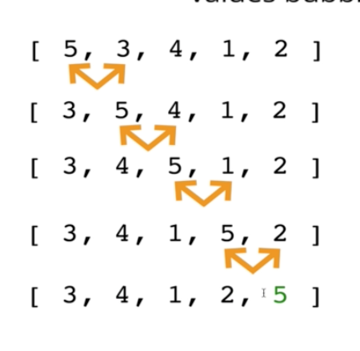

#### Intro

###### What is sorting?

- Sorting is the process of rearranging the items in a collection (like an array) so that the items are in some kind of order

- Sorting numbers from smallest to largest or vice versa
- Sorting names alphabetically

- Many different types of sort
- Some are very good in certain situations but terrible in others

###### Why do we need to learn this?

- Sorting is a common task, so it's good to know how it works
- There are many different ways ot sort things, and different techniques have their own advantages and disadvantages
    - https://www.toptal.com/developers/sorting-algorithms
- Classic interview topic

###### Built-in JavaScript sorting

- Javascript has a built in sort method
- Accepts an optional *comparator* function
- Comparator looks at pairs of elements (a and b)
    * If it returns a negatvie number, a should come before b
    * If it returns a positive number, a should come after b
    * If it returns 0, a and b are the same as far as the sort is concerned

#### Bubble sort

- Not very efficient
- Not very commonly used

- A sorting algorithm where the largest values bubble up to the top
    * visualgo
- As we loop through each item, we compare it to the next item
    * If this item is larger then the next item, you swap them
    * Do this for each item

[29, 10, 14, 30, 37, 14, 18]
- 29 > 10, so swap them
[10, 29, 14, 30, 37, 14, 18]
- 29 > 14, swap them
[10, 14, 29, 30, 37, 14, 18]
- 29 !> 30
[10, 14, 29, 30, 37, 14, 18]
- 30 !> 37
[10, 14, 29, 30, 37, 14, 18]
- 37 > 14
[10, 14, 29, 30, 14, 37, 18]
- 37 > 18
[10, 14, 29, 30, 14, 18, 37]

- Repeat the process again from arr[0]



- `Everytime you run through this process, you have 1 less item to sort`
- For example, with the above, 5 is now at the end and is the greatest value
- So don't need to compare against that value again

###### Before we sort, we must swap

- Many sorting algorithms involve some sort of swapping functionality (swapping numbers to put them in order for example)

*Different options in JS*

```
function swap(arr, idx1, idx2) {
    let temp = arr[idx1]
    arr[idx1] = arr[idx2]
    arr[idx2] = temp
}

const swap = (arr, idx1, idx2) => {
    [arr[idx1], arr[idx2]] = [arr[idx2], [arr[idx1]]]
}
```

###### BubbleSort Pseudocode

- Start looping from a variable called i at the end of the array towards the beginning
- Start an inner loop with a variable called j from the beginning until i - 1
- If arr[j] is greater than arr[j + 1], swap those two values
- At the end return the sorted array

#### Bubble Sort Optimization

- Very specific scenario where if our data is almost sorted or it it's already sorted, the bubble sort does not treat the data any differently
- It still tries to sort every single item
- Takes up a lot of unnecessary time
- All we need to do is check to see if any swaps were made on the last run

#### Big O Complexity

- In general it's O(n^2)
- If the data is nearly sorted or alrady sorted - it's more like O(n)
- That is the best case