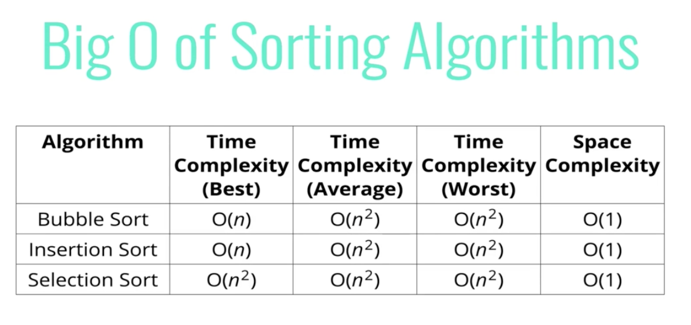

- Elementary sorting algorithms, quadratic sorting elements

- Everything is happening in place - not creating a new array or something like that

- Insertion sort works very well if you need your data to be continuously sorted

- All 3 are roughly equivalent in the grand scheme of things
- These are a good option when the data sets are small