#### Who was Dijkstra and what is his algorithm?

###### What is it

- One of the most famous and widely used algorithms around
- Finds the shortest path between two vertices on a graph
- "What's the fastest way to get from point A to point B?"

###### Who was he?

- Dutch programmer, physicist, essayist

###### Why is it useful?

- GPS - finding the fastest route
- Networking Routing - finds open shortest path for data
- Biology - used to model the spread of viruses among humans
- Airline tickets - finding cheapest route to your destination
- Many other uses

#### Walking though the Algorithm

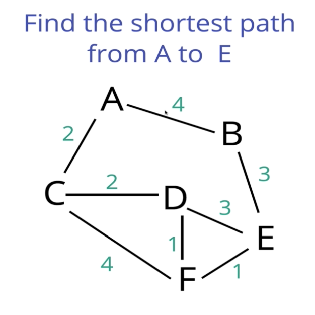

###### The Approach

1. Every time we look to visit a new node, we pick the node with the smallest known distance to visit first
2. Once we've moved to the node we're going to visit, we look at each of its neighbors
3. For each neighboring node, we calculate the distance by summing the total edges that lead to the node we're checking from the starting node
4. If the new total distance to a node is less than the previous total, we store the new shorter distance for that node

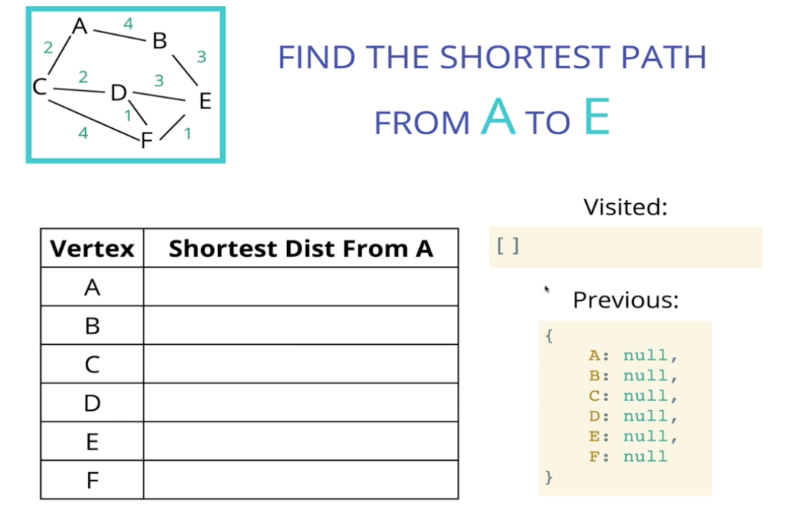

Initially you only know the distance from A to itself which is 0, you initialize everything else to an unknown - infinity here

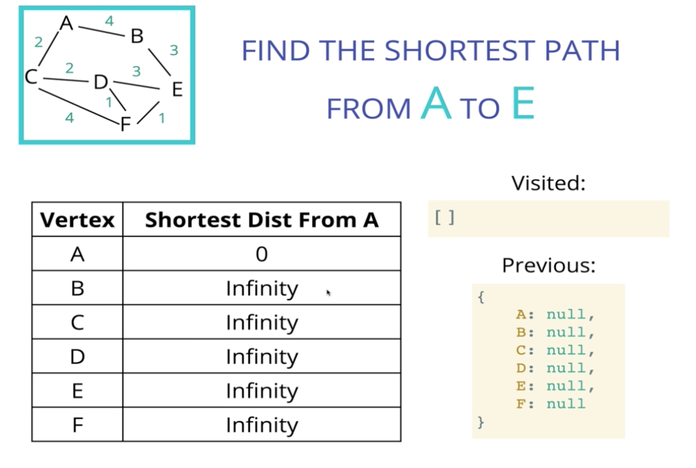
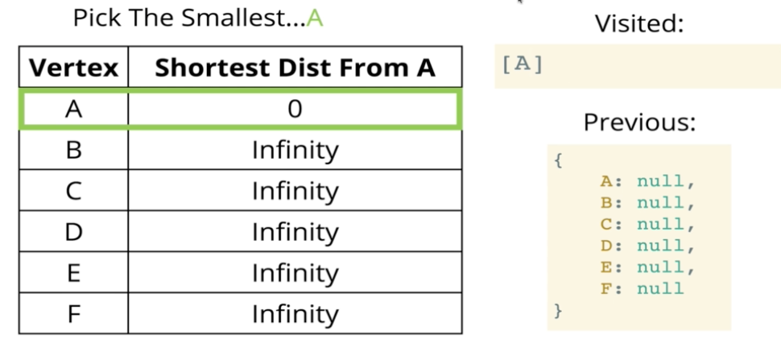

- Bottom right data structure says we came to "B" from "A" for example
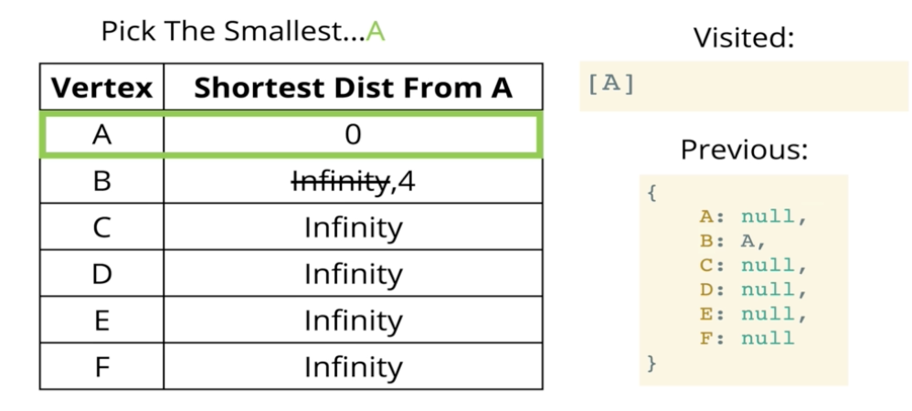

Now look at A to C

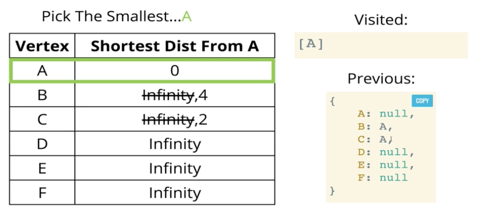

- Now we pick B (distance is 4) or C (distance is 2)
- Pick C b/c smallest known distance
- Now C has two (A already done) neighbors - D and F

- C to D first
- Calculate new value from A to D through C
- The way we do that is by summing A to C plus C to D

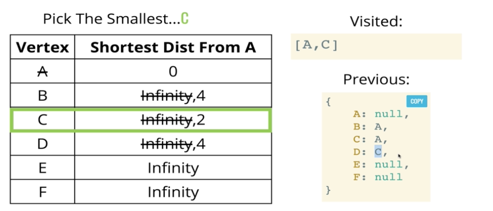

- C to F

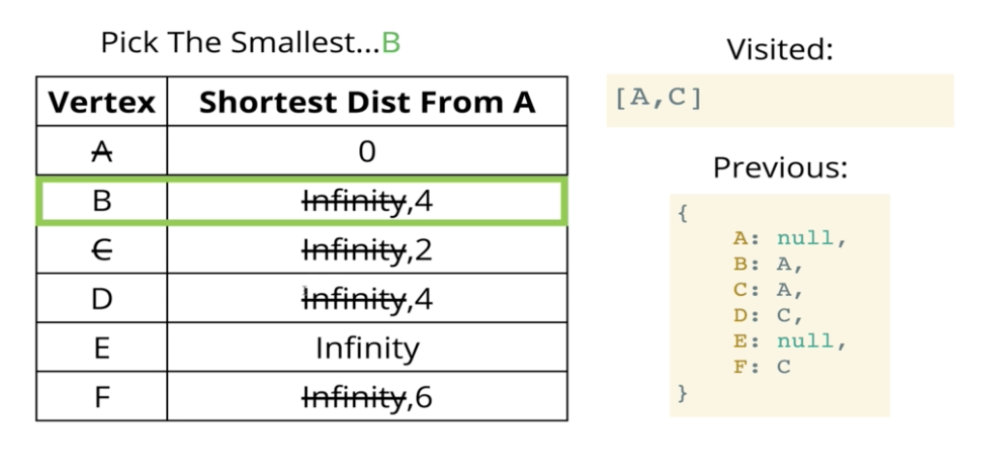

- Now we start over
- Pick the smallest distance from A that we haven't visited
- We've done A and C
- We can do B, D, or F(but distance for F is 6 so we won't look at that)

- B to E

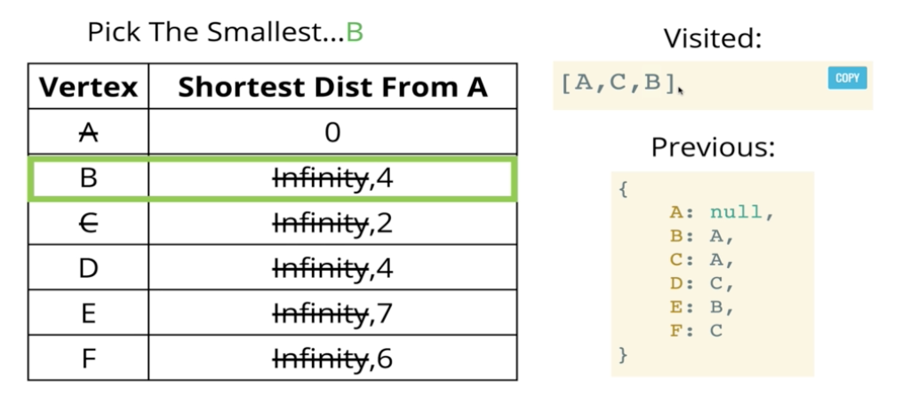

- Where to go next?
- D is the smallest between D, E, and F so go there next
- Go to E first
- A to E through D is 7 (4+3), which is not greater than the value (7) that is already stored at on E
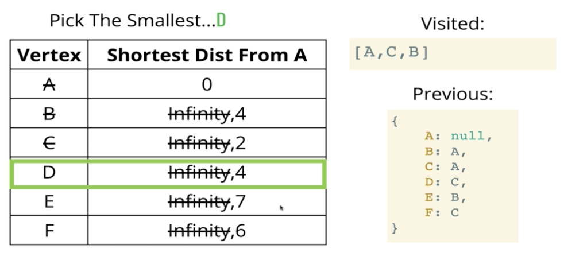

- D to F - 4+1 < 6 which is currently at vertex F, and now we update

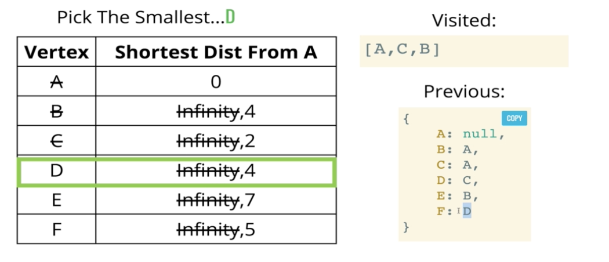

- Now pick the smallest again
- Out of E and F which is the smallest? It's F

- Look at F to E, only option left
- F - 5 + 1 < 7, so update

- No where left to go - we found the shortest path

- Now we just have to work backwards
- So to get to E from A, we start at E
- We got to E come through F
- To get to F come through D
- To get to D come through C
- To get to C come through A
- So A -> C -> D -> F -> E

- Dijkstra's algorithm gives us the shortest path from A to all the nodes

#### Introducing Simple Priority Queue

- Will use this to help us determine what path to look down next
- Priority is the distance from A (our starting point)

#### Dijkstra's Psuedocode

- This function should accept a starting and ending vertex
- Create an object (distances) and set each key to be every vertex in the adjacency list with a value of infinity, except for the starting vertex which should have a value of 0
- After setting a value in the distances object, add each vertex with a priorit of infinity to the priority queue, except the starting vertex, which should have a priority of 0 b/c that's where we begin
- Create another object called previous and set each key to be every vertex in the adjacency list with a value of null
- Start looping as long as there is anything in the priority queue
    * dequeus a vertex from the priority queue
    * If the vertex is the same as the ending vertex - we are done
    * Otherwise loop through each value in the adjacency list at the vertex
        - Calculate the distance to that vertex from the starting vertex
        - If the distance is less than what is currently stored in our distances object
            * Update the distances object with new lower distance
            * Update the previous object to contain that vertex
            * Enqueue the vertex with the total distance from the start node