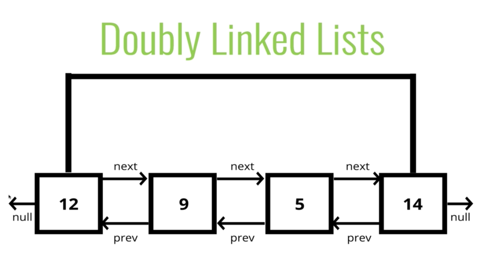

#### Intro

- Almost identical to SLLs except every node has **another** pointer to the **previous** node

- Makes some operations simpler
- Like remove for example, can just start at the tail and go back one item
- Reversing a DLL is very easy
- Traversing a DLL in reverse is very easy
    * The same is not true for SLL

######
- Real drawback between DLLs and SLLs is that DLLs use more memory
- More memory === More flexibiltiy - have to store a previous and a next
- This is **almost** always a tradeoff in programming

#### Push

- Adding a node to the **end** of the DLL

*Pushing pseudocode*

- Create a new node with the value passed to the function
- If the tail property is null set the head and tail to be the newly created node
- If not, set the next property on the tail to be that node (creating arrow forwards)
- Set the previous property on the newly created node to be the tail (creating arrow backwards)
- Increment the length
- Return the DLL

#### Pop

- Removing a node from the **end** of the DLL
- With a DLL you can work backwards because your tail has a reference to the previous node

*Popping pseudocode*

- If there is no head, return undefined
- Store the current tail in a variable to return later
- If the length is 1, set the head and tail to be null, the list is now empty
- Update the tail to be the previous node
- Set the newTail's next to be null
- Set the oldTail's prev to be null as well to clean up references
- Decrement the length
- Return oldTail (the value we removed)

#### Shift

- Removing a node from the **beginning** of the DLL

*Shifting Pseudocode*

- If length is 0, return undefined
- Store the current head property in a variable (oldHead)
- If the length is -, set the head and tail to be null
- Update the head to be next of the old head
- Set the head's prev property to null
- Set the old head's next to null
- Decrememnt the length
- Return the old head

#### Unshfit

- Adding node to the beginning of the list

*Unshift Pseudocode*

- Create a new node with the value passed to the function
- If the length is 0
    * Set the head to be the new node
    * Set the tail to be the new node
- Otherwise
    * Set the prev property on the head of the list to be the new node
    * Set the next property on the new head to be the head property
    * Update the head to be the new node
- Increment the length
- Return the list

#### Get

- Accessing a node in a DLL by its position
- Optimal solution is to work from the beginning or end depending on the size of the list
- If you have a 10 item list, and they are looking for the 7th item, it would be optimal to start at the end (the 7th index is closer to the 9th index)

*Get Pseudocode*

- If the index is less than 0 or greater or equal to the length, return null
- If the index is less than or equal to half the length the list
    * Loop through the list starting from the head and loop towards the middle
    * Return the node once it is found
- If the index is greater than half the length of the list
    * Loop through the list starting from the tail and loop towards the middle
    * Return the node once it is found

#### Set

- Create a variable which is the result of the **get** method at the index passed to the function
    * If the **get** method returns a valid node, set the value of that node to be the value passed to the function
    * Return true
- Otherwise return false

#### Insert

- Adding a node in a Doubly Linked List by a certain position
- We can optimize this because we can start at the beginning or end
    * We already have an optimized get method

*Insert Pseudocode*

- If the index is less than zero or greater than or equal to the length return false
- If the index is 0, use **unshift**
- If the index is the same as the length, **push**
- Otherwise use the **get** method to access the index - 1
- Sex the next and prev on the correct nodes to link everything together
- Incremement the length
- Return true

#### Remove

*Remove Pseudocode*

- If the index is less than zero or greater than or equal to length return undefined
- If the index is 0, shift
- If the index is the same as the length - 1, **pop**
- Else use the **get** method to retrieve the item to be removed
- Update the next and prev properties to remove the found node from the list
- Set next and prev to null on the found node
- Decrememnt the length
- Return the removed node

#### Big O of Doubly Linked Lists

- Insertion - (specifically at the beginning/end) is O(1)
    * Otherwise it is O(n)
- Removal - (specifically at the beginning/end) is O(1)
    * Otherwise it is O(n)
- Searching - O(n)
- Access - O(n)

- Technically searching/accessing/inserting/removal is O(n/2) with divide and conquer approach but that's still O(n)

###### Recap

- DLLs are almost identical to SLLs except there is an additional pointer to previous nodes

- If you need to start at the end and work backwards often
    * Like you're browser history - this is often implemented with a DLL
        - Every page that you're on has a next and a previous
- Better than SLLs for finding nodes and can be done in half the time
- However, they do take up more memory considering the extra pointer
