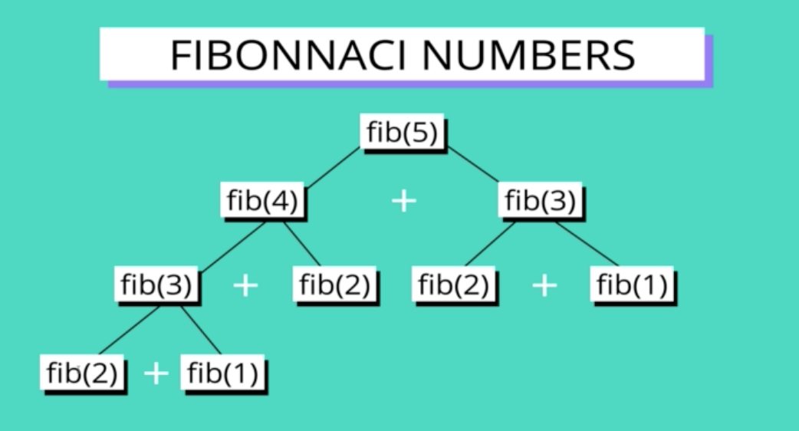
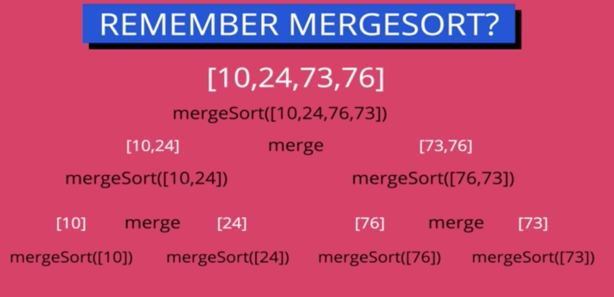
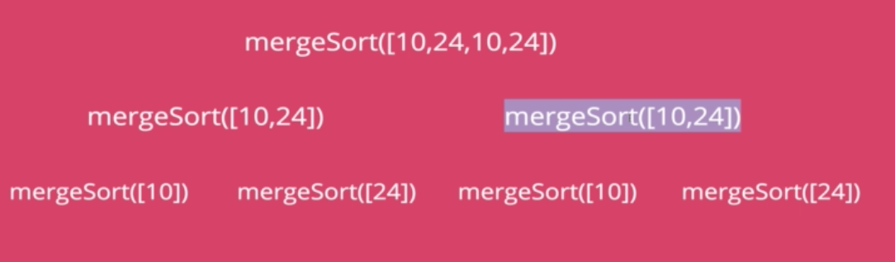

#### Intro

###### What Is It?

- A method for solving a complex problem by breaking it down into a collection of simpler subproblems, solving each of those subproblems just once, and storing their solutions

- Approach for solving *some* problems
- Most problems cannot be solved with it
- But ones that can be solved with dynamic programming can make a huge different in performance when dynamic programming is used

###### Where does the name come from?

- Not really what it sounds like
- Dynamic is meant to capture the time-varying aspect of the problems
- Programmer doesn't refer to computer programming - refers to finding an optimal *program*
- What it actually refers to is coming up with an optimal soluton both outside of the code world and it is now applied inside the computer science world

#### Overlapping subproblems

- Only works on problems with optimal substructure & overlapping subproblems

###### Overlapping Subproblems

- A problem is said to have **overlapping subproblems** if it can be broken down into subproblems that can be used several time
- Ex: Fibonacci Sequence - Every number after the first two is the sum of the two preceeding numbers

- We can see here that fibonacci numbers will be calculated several times - fib(2) is on here twice, fib(3) is on here 2 times, etc
    * These are overlapping repeating subproblems

- When we use recursion we break things down into subproblems, but that doesn't mean that they overlap
- Overlapping subproblems - we need to look for repetition, things where we're repeating some subproblem

- Mergesort breaks sorting down into subproblems, but they are not overlapping subproblems
    * We are not repeating the same thing, we are sorting different pieces every time

###### A Very Special Case with Merge Sort

- We are having to sort the array [10, 24] twice, this is a case where we do have overlapping subproblems with a mergesort

#### Optimal Substructure