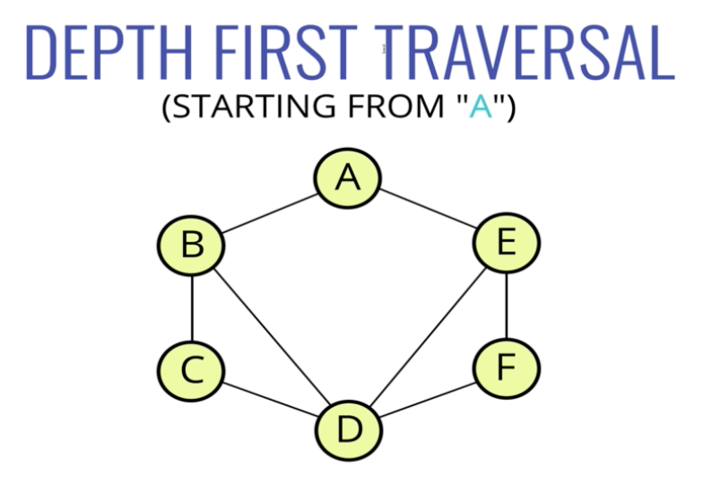
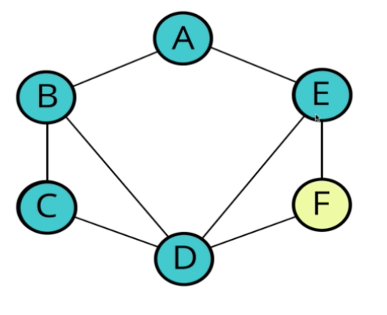
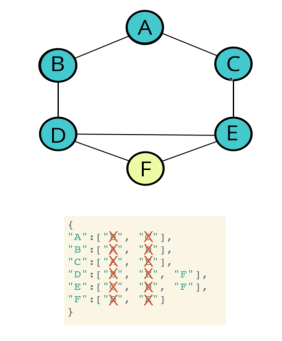

#### Intro

- Graph traversal is visting/updating/checking each vertex in a graph
- Remember that trees are a special subset of a graph where for any given node there is only one path to get to another node
- Unlike a tree, we need to specify our starting point
- For any node in the graph, there's no guarantee that there's one unique path to get there
    * Doesn't mean that traversing is harder or more difficult
    * May visit a node more than once

###### Graph Traversal Uses
- Peer to peer networking
- Web crawlers
- Finding "closest" matches/recommendations
- Shortest path problems
    * GPS navigation
    * Solving mazes
    * AI (shortest path to win the game)

#### Depth First Traversal/Search

- Really important to remember where we've been

Another example

- Now from "C" it's a dead end
- Go back to "E" and now go to "F"

Another example
- Note: we aren't deleting the x'd out values, just ignoring them next time we've seen them

#### DFS Recursion Intro

###### DFS Pseudocode

DFS(vertex):
    if vertex is empty
        return (this is base case)
    add vertex to results list
    mark vertex as visited
    for each neighbor in vertex's neighbors:
        if neighbor is not visited:
            recursively call DFS on neighbor

- Recursively call DFS on all of A's neighbors (B and C)
    * Because this is recursive, B will finish first and then C will go

- This function should accept a starting node
- Create a list to store the end result, to be returned at the very end
- Create an object to store visited vertices
    * The helper function should return early if the vertex is empty
    * The helper function should place the vertex it accepts into the visited object and push that vertex into the result array
    * Loop over all of the values in the adjacencyList for that vertex
    * If any of those values have not been visited, recursively invoke the helper function with that vertex
- Invoke the helper function with the starting vertexs

#### DFS Recursive Solution

- Call stack

depthFirstRecursive("A")

dfs("A")
visited["A"] = true
result = ["A"]
for each neighbor of A (B and C)

dfs("B")
visited["B"] = true
result = ["A", "B"]
for each neighbor of B (A & D) - already visited A

dfs("D")
visited["D"] = true
result = ["A", "B", "D"]
for each neighbor of D (B, E, F) - already visited B

dfs("E")
visited["E"] = true
result = ["A", "B", "D", "E"]
for each neighbor of E (C, D, F) - C already visited

dfs("C")
visited["C"] = true
result = ["A", "B", "D", "E", "C"]
for each neighbor of C (A, E) - A and E already visited

dfs("F")
visited["F"] = true
result = ["A", "B", "D", "E", "C", "F"]
All neighbors of F already visited

- All vertices have been visted now and all of the calls are popped off of the calls stack

#### DFS Iterative Intro

dfsIterative(start):
    let S be a stack
    S.push(start)
    while S is not empty
        vertex = S.pop()
        if vertex is not labeled as discovered:
            visit vertex (add to result list)
            label vertex as discovered
            for each of vertex's neighbors
                S.push(N)

###### DFT - Iterative

- The function should accept a starting node
- Create a stack to help keep track of vertices (use a list/array)
- Create a list to store the end result, to be returned at the very end
- Create an object to store visited vertices
- Add the starting vertex to the stack, and mark it visited
- While the stack has something in it:
    * Pop the next vertex from the stack
    * If that vertex hasn't been visited yet:
        - Mark it as visited
        - Add it to the result list
        - Push all of its neighbors into the stack
- Return the result array

#### Breadth First

- Visit neighbors at current depth first

Visit all of A's neighbors - B and E

- Then go back to B and visit all of its neighbors - A (already visited), C, D

- Then go back to E and visit all of its neighbors - A (already visited), D (already visited), and F

- This function should accept a starting vertex
- Create a queue (you can use an array) and place the starting vertex in it
- Create an array to store the nodes visited
- Mark the starting vertex as visited
- Loop as long as there is anything in the queue
- Remove the first vertex from the queue and push into the array that nodes visited
- Loop over each vertex in the adjacency list for the vertex you are visiting
- If it is not inside the object that stores nodes visited, mark it as visited and enqueue that vertex
- Once you have finished looping, return the array of nodes visited

#### BFS Solution

Queue: [A]
Result: []

Queue: [B, C]
Result: [A]

Queue: [C, D] - A already captured so A is ignored
Result: [A, B]

Queue: [D, E]
Result: [A, B, C]

Queue: [E, F]
Result: [A, B, C, D]

Queue: [F]
Result: [A, B, C, D, E]

Queue: []
Result: [A, B, C, D, E, F]