#### Intro

- Used it social networks, any time we're modeling users, recommendation engines (think Netflix)

###### What Are Graphs?

- A collection of nodes and connections between those nodes

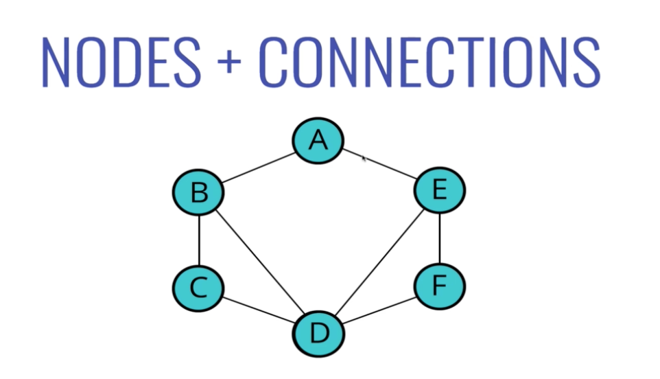

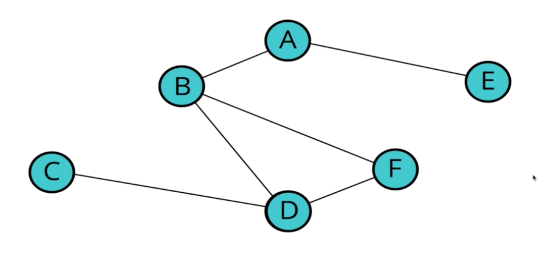

- A tree is a type of a graph

###### Uses for Graphs

- Social networking
- Location/Mapping
- Routing Algorithms
- Visual Hierarchy
- File System Optimizations

- The internet can be modeled as a graph

#### Types of Graphs

###### Essential Graph Terms

- **Vertix** - a node
- **Edge** - connection between nodes
- **Weighted/Unweighted** - values assigned to distances between vertices
- **Directed/Unidrected** - directions assigned to distances between vertices

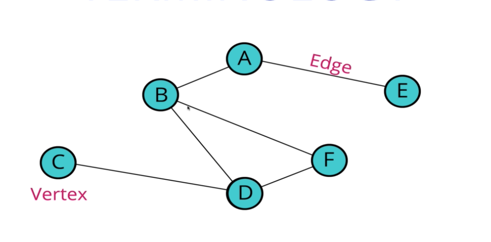

- A tree is a graph in which any two vertices are connected by exactly one path

Undirected Graph
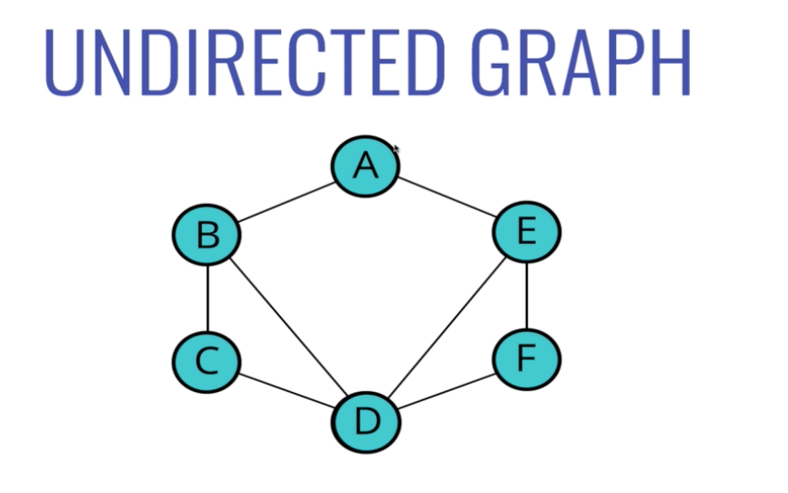

Directed Graph
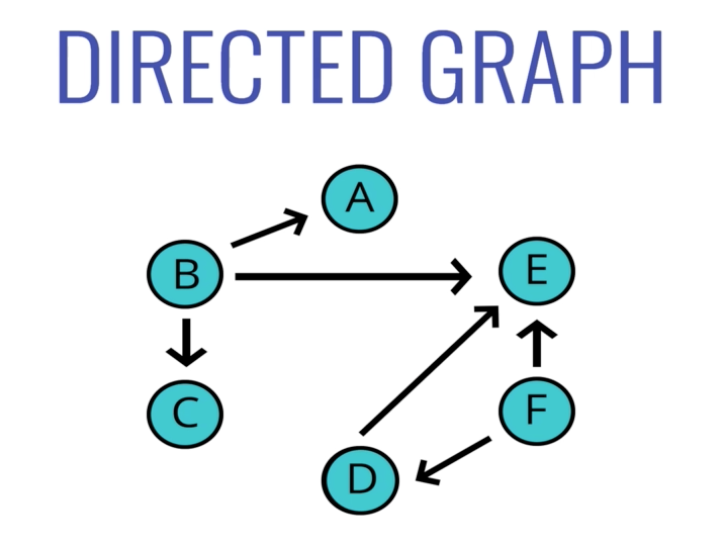

- Unweighted example - facebook, both parties have to accept the other person's request
    * All connections are two way
- Weighted example - instagram, you can follow someone else, but the other person doesn't have to follow you
    * All connections are not two way

Weighted Graph
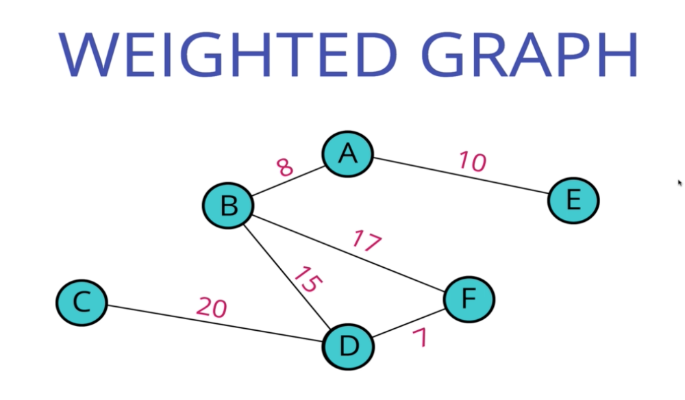

Unweighted Graph
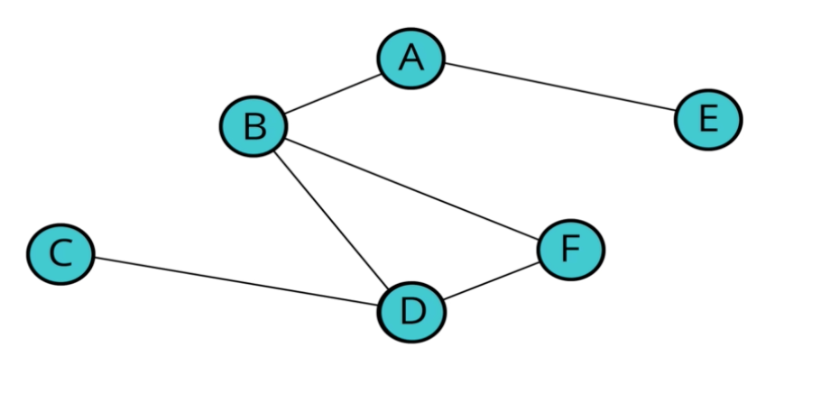

#### Storing Graphs: Adjacency Matrix

- What we need to actually store are the vertices/nodes and then a way of storing the connections

- With a Linked List for example, we did next and previous if it was a DLL
- Wiht a binary search tree we had a dot left and a dot right
- That's not going to work for a graph b/c there's any number of nodes and number of connections between the node

- Two standard approaches
- Adjacency matrix
- Adjacency list

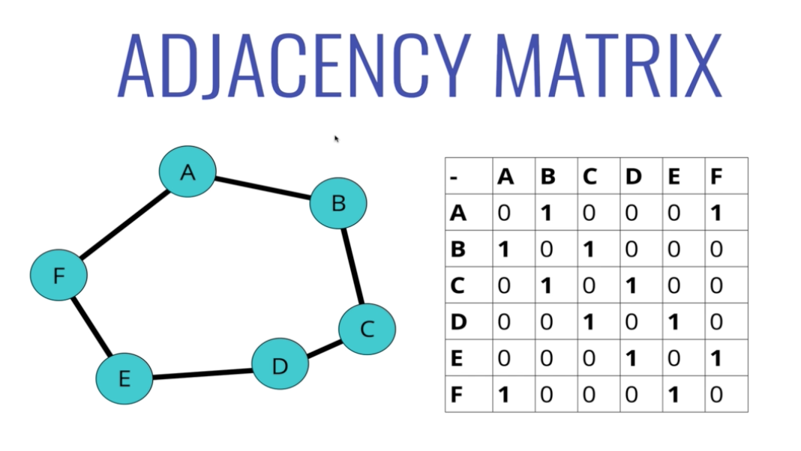

- 1s represent the an edge, 0s represent a lack of an edge
- Adding a new edge represents a new row and column represent that new node

#### Storing Graphs - Adjacency List

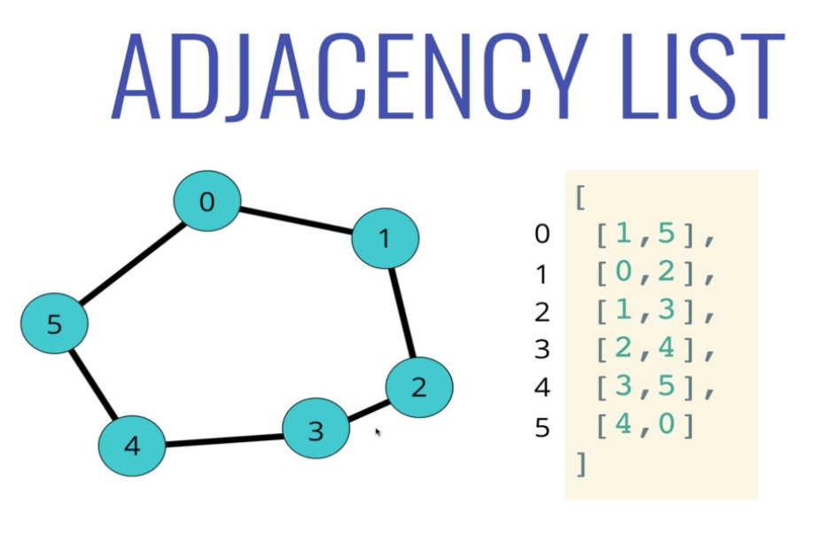

- What are the edges for 3, go to index 3, and the array is [2, 4]
- 3 is connected to 2 and 4

- If we wanted to know is there an edge between 5 and 1
    * Either look at index 1 and look 5
    * Or Look at index 5 and look for 1
- This works well when are nodes are numeric

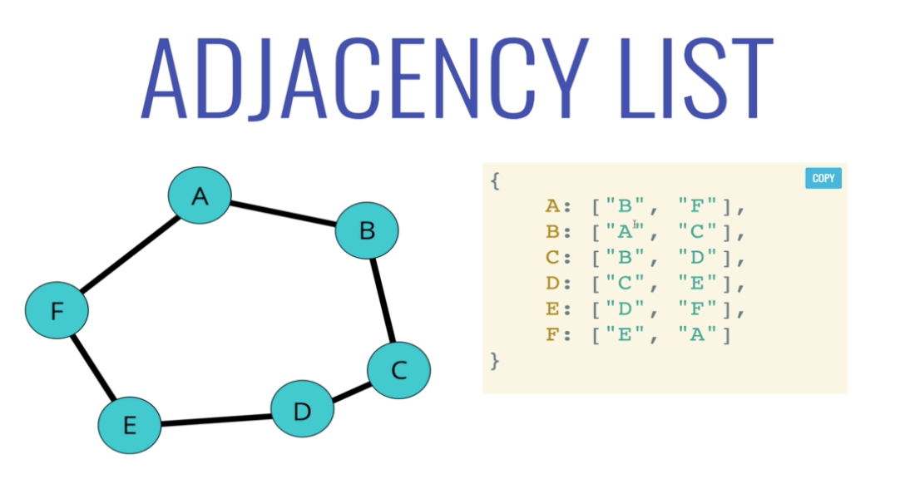

- This works better
- Could use a hash table - use a key/value pair data structure
    * A dictionary, javascript object, a map (depends on the language)
- Can now look up "A" and see that there's an edge between "A" and "B" and "A" and "F"

#### Adjacency Matrix vs List - Big O

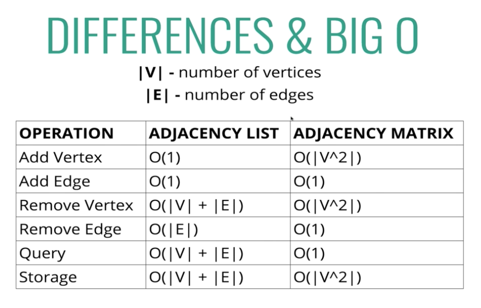

- For a list, the size is determined by how many edges we have
- For a matrix, the size is determined by the vertices
    * Adding a new vertex adds a new row and column to the matrix

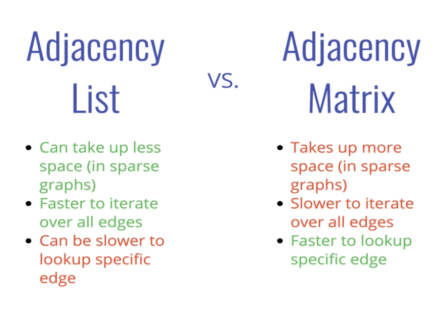

###### What will we use?

- Undirected Adjacency List
- Most data in the real world tends to lend itself to sparser and/or larger graphs
- Could have a ton of nodes/vertices, but usually they're not all connected and that lends itself more to adjacency lists

#### Add Vertex Intro

###### Our Graph Class

```
class Graph {
    constructor() {
        this.adjacencyList = {}
    }
}
```

###### Adding a vertix

- Write a method called `addVertex` which accepts a name of a vertex
- It should add a key to the adjacency list with the name of the vertex and set its values to be an empty array
`g.addVertex("Tokyo")`
Adjacency list is now `{ "Tokyo": [] }`

#### Add Edge Intro

###### Adding An Edge

- This function should accept two vertices, we can call them vertex1 and vertex2
- The function should find in the adjacency list the key of vertex1 and push vertex2 to the array
- The function should find in the adjacency list the key of vertex2 and push vertex1 to the array
- Don't worry about handling errors or invalid vertices

- Remember: This is an undirected graph

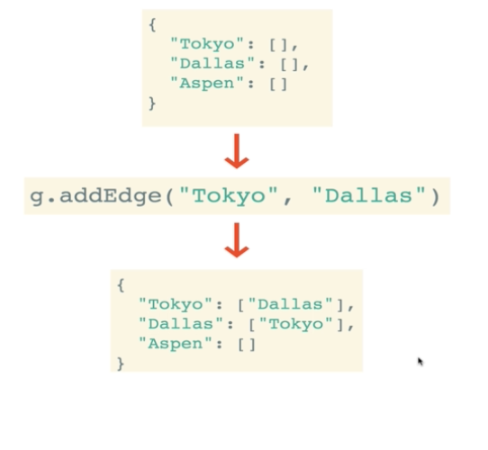

#### Remove Edge Intro

###### Removing an Edge

- This function should accept two vertices, we'll call them vertex1 and vertex2
- The function should reassign the key of vertex1 to be an array that does not contain vertex2
- The function should reassign the key of vertex2 to be an array that does not contain vertex1
- Don't worry about handling errors/invalid vertieces

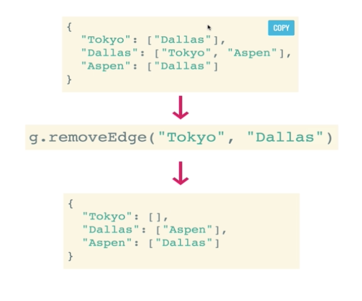

#### Remove Vertex Intro

- This function should accept a vertex to remove
- The function should loop as long as there are any other vertices in the adjacency list for that vertex
- Inside of the loop, call our **removeEdge** function with the vertex we are removing and any values in the adjacency list for that matrix
- Delete the key in the adjacency list for that vertex

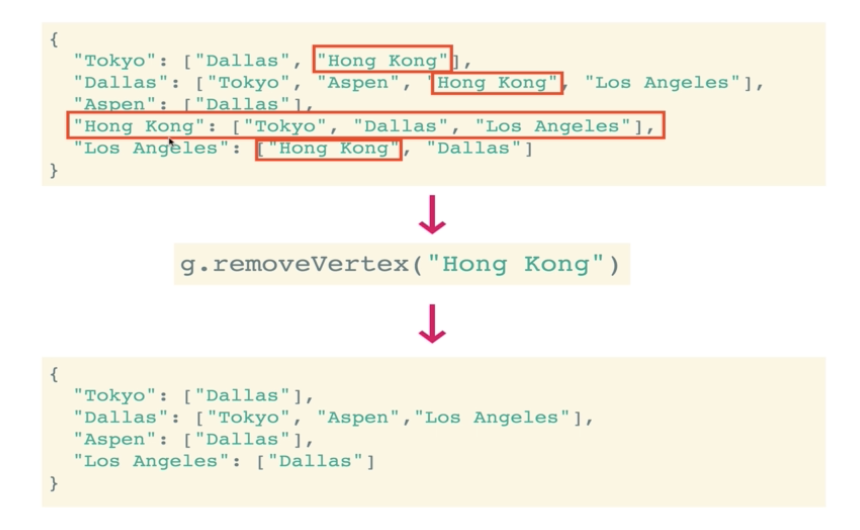


- Trees are a special subset of a graph