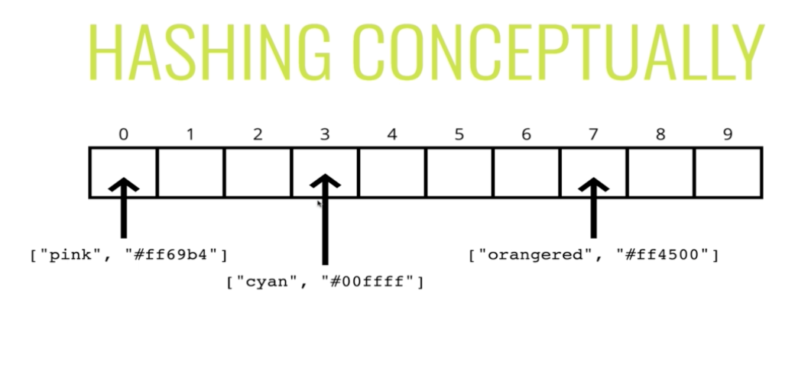
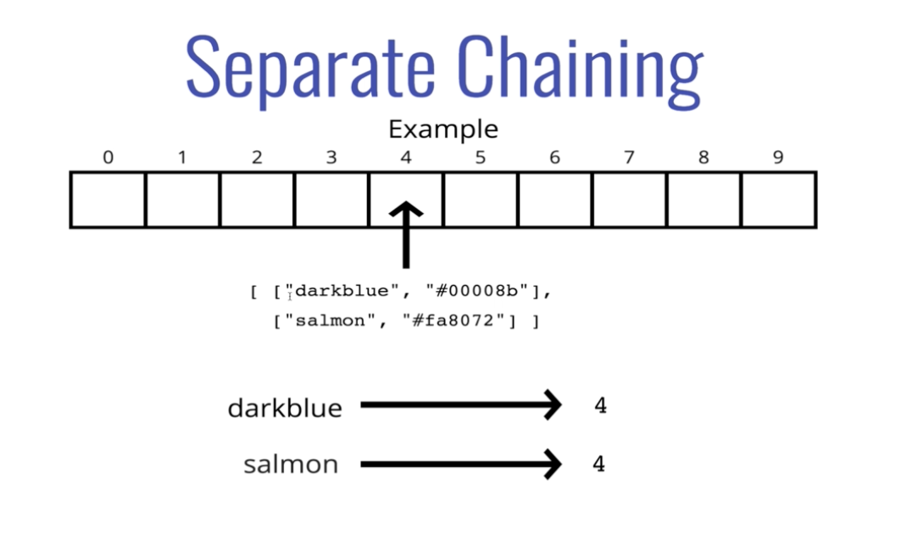
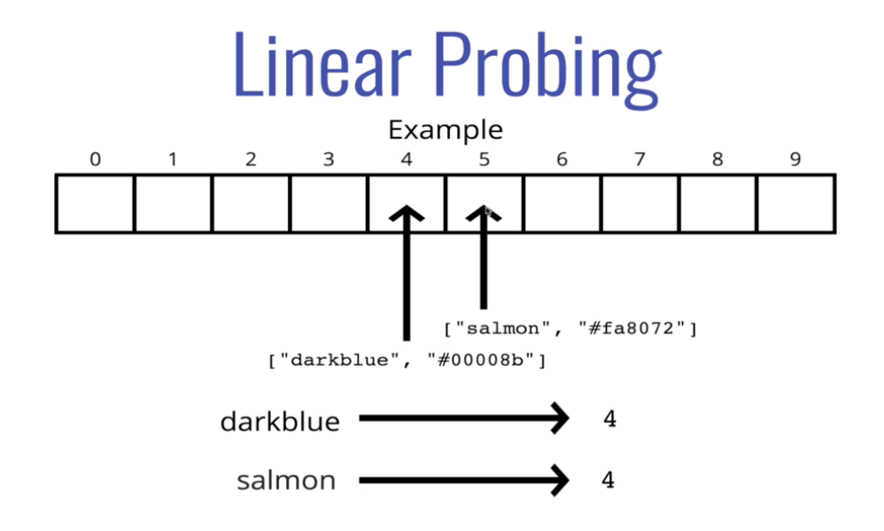

#### Intro

- Also commonly called a *hash map*
- Built in to a lot of programming languages
    * Just like with an array you can just use it out of the box

###### Hash Table

- Hash tables are used to store *key-value* pairs
- They are like arrays, but the keys are not ordered
- Unlike arrays, hash tables are *fast* for all of the following operations
    * Finding values
    * Adding new values
    * Removing values

###### Why Should I Care

- Nearly every programming language has some sort of hash table data structure
- B/c of their speed, hash tables are very commonly used

####### Hash Tables In The Wild

- Python has Dictionaries
- Js has Objects and Maps (Objects have some restrictions, but are basically hash tables)
- Java, Go, and Scala have Maps
- Ruby has Hashes

- Hash tables are a generic idea and you can implement them in many ways

###### Hash Tables

- Imagine we want to store some colors
- We could just use an array/list
- If would be nice if instead of using indices to access the colors, we could use more human readable keys

```
pink -> #ff69b4
orangered -> ##ff4500
```

- colors["cyan"] is way better than colors[2]

#### More About Hash Tables

- How can we get human-readability and computer readability
- Computers don't know how to find an element at index pink
- Has tables fix this issue

###### The Hash Part

- To implement a hash table, we'll be using an array
- In order to look up values by key, we need a way to convert keys into valid array indices
- A function that performs this task is called a hash function or hashing functions

###### Hashing Conceptutally



- The hashing function tells you where to put your string inside of the array
- If you want to get an existing value in the array, you use the hash function to get the index

#### The Hash Part

- Used to convert keys (strings specifically) into a valid index
- Hash functions have a lot of appliations in other things like privacy as well
- A hash function is a function that takes data of arbitrary size whether it's going to spit out data of a fixed size
    * Maps input to an output of a fixed size

- In most cases of a hash function, we can't work backwards
    * If we have the output from a hash function, we can't get the input
    * It's a one way input

###### What Makes A Good Hash?

(Not a cryptographically secure one)

- Fast (i.e. constant time)
- Doesn't cluster outputs at specific indices, but distributes uniformly
    * Could have collisions
- Deterministic (same input yields same output)

#### Writing Our First Hash Function

- Simple example
- Hash that works on *strings* only
- index.js

```
function hash (key, arrayLen) {
    let total = 0
    for (let char of key) {
        let value = char.charCodeAt(0) - 96
        total = (total + value) % arrayLen
    }
    return total
}
```

###### Refining Our Hash

- Problems
1. Only hashes strings (we won't worry about this)
2. Not constant time - linear in key length
3. Could be more random (our current implementation could be clustered easily)

#### Improving Our Has Function

- refining.js

```
function hash (key, arrayLen) {
    let total = 0
    let WEIRD_PRIME = 31
    for (let i = 0; i < Math.min(key.length, 100); i++) {
        let char = key[i]
        let value = char.charCodeAt(0) - 96
        total = (total * WEIRD_PRIME + value) % arrayLen
    }
    return total
}
```

- Hash functions almost always take advantage of prime numbers
- Comes down to reducing collisions

###### Prime Numbers?

- The prime number in the hash is helpful in spreading out keys more uniformly
- It's also helpful if the array that you're putting vlaues into has a prime length

#### Handling Collisions

- Even with a large array and a great hash function, collisions are inevitable
- There are many strategies, but we'll focus on two

1. Separate chaining
2. Linear probing

###### Separate Chaining

- With *separate chaining*, at each index in our array we store values using a more sophisticated data structure (e.g. an array or linked list)
- This allows us to store multiple key-value pairs at the same position



- Store things together

###### Linear Probing

- With *linear probing*, when we find a collision, we search through the array to find the next empty slot
- Unlike with separate chaining, this allows us to store a single key-value at each index



###### Linear Probing vs Separate Chaining

- Separate chaining allows you to store more things in the array than the array is long, this is not true with linear probing

#### Hash Table Get and Set

- get-and-set.js

###### Set/Get

**set**
1. Accepts a key and a value
2. Hashes the key
3. Stores the key-value pair in the hash table array via separate chaining

**get**
1. Accepts a key
2. Hashes the key
3. Retrieves the key-value in the hash table
4. If the key isn't found, returns undefined

#### Hash Table Keys and Values

**keys**
1. Loops through the hash table array and returns an array of keys in the table

**values**
1. Loops through the hash table array and returns an array of values in the table
    * Could have multiple values that are the same
    * Most of the time it's just the unique values you return (or the unique keys - keys should be unique anyways)

###### Extra information

- Currently can add duplicate keys to the array
- In most languages it if you try and insert the same key, it will overwrite the old key and value with the new key and value

#### Big O Complexity

- Average Case
- Insert: O(1)
- Deletion: O(1)
- Access: O(1)

- Comes down to how good your hash function (how fast the hash function itself is and how evenly it distributes the data) 


- Worst case
- O(n)

###### Recap

- Hash tables are collections of key-value pairs
- Hash tables can find values very quickly given a key
- Hash tables can add new key-values quickly
- Hash tables store data in a large array, and work by *hashing* the keys
- A good hash (or hash funtion, same thing) should be fast, distribute keys uniformly, and be deterministic
- Separate chaining and linear probing are two strategies used to deal with two keys that hash to the same index