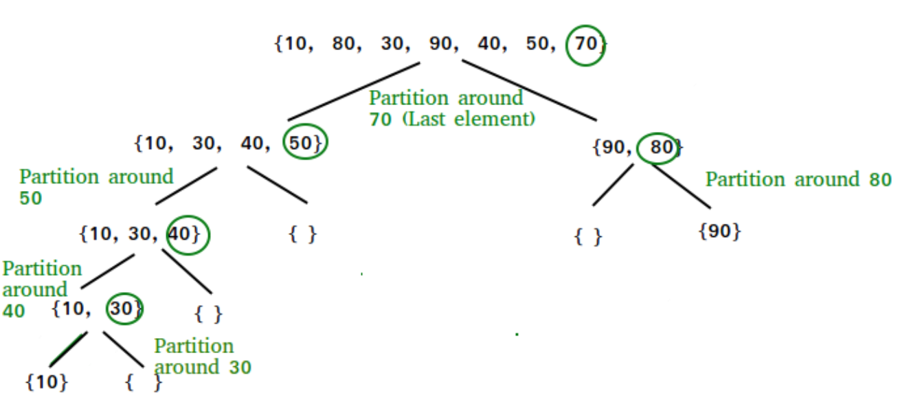

https://www.geeksforgeeks.org/quick-sort/

###### QuickSort

- Like `MergeSort`, QuickSort is a Divide and Conquer algorithm
- It picks an element as a pick and partitions the given array around the picked pivot
- There are many different versions of QuickSort that pick the pivot in different ways

```
1. ALways pick the first elemenet as the pivot
2. Always pick the last element as the pivot (look at figure below)
3. Pick a random element as the pivot
4. Pick median as pivot
```

- The key process in QuickSort is `partition()`
- Given an array and an element of x as the pivot point, put x at its correct position in the sorted array and put all smaller elements (smaller than x) before x, and put all greater elements (greater than x) after x
- This should be done in linear time



######## Analysis of QuickSort

- Time taken by QuickSort in general can be written as:
` T(n) = T(k) + T(n-k-1) + theta(n)`

- The `first two terms are for the two recursive calls`, `the last term is for the partition process`
- K is the number of elements which are smaller than the pivot

- The time taken by QuickSort depends upon the input array and partition strategy

***Worse case***

- `The worse case occurs when the partition process always picks the greatest or smallest element as pivot`
- If we consider the above partition strategy where the last element is always picked as pivot, the worst case would occur when the already is already sorted in increasing or decreasing order

```
 T(n) = T(0) + T(n-1) + theta(n)
which is equivalent to  
 T(n) = T(n-1) + theta(n)
 ```

 - The solution of above recurrence is theta(n^2)


 ***Best Case***

 - `The best case occurs when the partition process always picks the middle element as pivot`
 - The following is recurrence for best case

`T(n) = 2T(n/2) + theta(n)`

- The solution of above recurrence is theta(nLogn)
- `It can be solved using case 2 of Master Theorem

***Average Case***

- To do average case analysis, we need to consider all possible permutation of array and calculate time taken by every permutation
- `Can get an idea of average case by considering the case when the partition puts O(n/9) elements in one set and O(9n/10) elements in the other set`
- The following is recurrence for this case
` T(n) = T(n/9) + T(9n/10) + theta(n)`

- Solution of above recurrence is also O(nLogn)


- Although the worst case time complexity of QuickSort is O(n^2) which is more than many other sorting algorithms like `MergeSort` and `HeapSort`, QuickSort is faster in practice, b/c its inner loop can be implemented efficiently on most architectures, and in most real-world data
- QuickSort can be implemented in different ways by changing the choice of pivot, so that the worst case rarely occurs for a given type of data
- However, merge sort is generally considered better when the data is huge and stored in external storage

######## Is QuickSort stable?

- The default implementation is not stable
- However, any sorting algorithm can be made stable by considering indexes as comparison parameter

######## What is 3-Way QuickSort?

- In a simple QuickSort algorithm, we select and element as pivot, partition the array around the pivot and recur for subarrays on left and right of pivot
- Consider an array which as many redundant elements like [1, 4, 2, 4, 2, 4, 1, 2, 4, 1, 2, 2, 2, 4, 1, 4, 4, 4]
- If 4 is packed as a pivot in Simple QuickSort, we fix only one 4 and recursively process remaining occurrences
- In 3 Way QuickSort, an array[l...r] is divided into 3 parts
a) arr[l...i] elements less than pivot
b) arr[i+1...j-1] elements equal to pivot
c) arr[j...r] elements greater than pivot

######## Why QuickSort is preferred over MergeSort for sorting arrays

- QuickSort in its general form is an in-place sort (doesn't require extra storage) whereas merge sort requires O(N) extra storage, N denoting the array size which may be large
- `Allocating and deallocating extra space used for merge sort increases the running time of the algorithm`
- Comparing average complexity, we find that both type of sorts have O(NlogN) average complexity but the constants differ
- For arrays, merge sort loses due to the use of extra O(N) storage space

- Most practical implementatoins of QuickSort use randomized version
- `The randomized version has expected time complexity of O(nLogn)`
- The worst case is possible in randomized versions also, but worst case doesn't occur for a particular pattern (like sorted array) and randomized QuickSort works well in practice

- QuickSort is also a cache friendly sorting algorithm as it has good locality of reference when used for arrays

- QuickSort is also tail recursive, so tail call optimizations are done

######## Why MergeSort is preferred over QuickSort for Linked Lists?

- In case of linked lists the case is different mainly due to the difference in memory allocation of arrays and linked lists
- Unlike arrays, linked list nodes may not be adjacent in memory
- Unlike a array, in a linked list, we can insert items in the middle in O(1) extra space and O(1) time
- Therefore the merge operation of a MergeSort can be implemented w/o extra space for linked lists

- In arrays, we do random access as elements are continuous in memory
- Let's say we have an integer (4 byte) array A and let the address of A[0] be x, then to access A[i] we can directly access the memory at (x + i*4)
- Unlike arrays, we cannot do random access in a linked list
- QuickSort requires a lot of this kind of access
- In a linked list to access the i'th index, we have to travel each and every node form the head to the i'th node as we don't have a continuous block of memory
- Therefore, the overhead increases quickly for QuickSort
- MergeSort accesses data sequentially and the need of random access is low