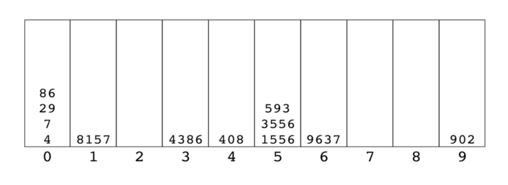

#### Intro

- All of the sorts that we've seen so far are grouped together in a grouped called `comparison`

###### Comparison

- At the base we have a comparison between two items and we're deciding which one comes first/second
- Compare 2 at most at any given time

**Average Time Complexity**

- Bubble sort - O(n^2)
- Insertion sort - O(n^2)
- Selection sort - O(n^2)
- Quick sort - O(nlogn)
- Merge sort - O(nlogn)

###### Can we do better?

- Yes but not by doing comparison sort
- In a comparison sort, the best time complexity we can ever hope for is O(nlogn)
- Integer sorting algorithms - Radix sort for example - does not use direct comparison
    * It uses special properties of data
    * Never actually comparing if num1 is greater/less than num2

###### Radix Sort

- Special sorting algorithms that works on lists of numbers
- Never makes comparisons between elements
- Exploits the fact that information about the size of a number is encoded in the number of digits
- More digits means a bigger number

###### How does it work?

[1556, 4, 3556, 593, 408, 4386, 902, 7, 8157, 86, 9637, 29]

- Create 10 different buckets

- Numbers are not ordered within the buckets

- Reform them into an array based on their current order

- Now we sort them based off of their 2nd digit from the right

- Reform them into list

- Now we sort them based off of their 3rd digit from the right

- Reform them into list
- The number of times we actually have to do this process depends on the largest number

- Reform the list

#### Radix Sort Helpers

- In order to implement radix sort, it's helpful to build a few helper functions first:
- getDigit(num, place) - return the digit in num at the given place value

- The end is the zeroth position

- mostDigits(nums) - Given an array of numbers, returns the number of digits in the largest numbers in the list

`mostDigits([1234, 56, 7]) // 4`

#### Radix Sort Pseudocode

- Define a function that accepts a list of numbers
- Figure out how many digits the largest number has (mostDigits)
- Loop from k = 0 up to this largest number of digits
- For each iteration of the loop:
    - Create a bucket for each bucket (0 to 9)
    - Place each number in the corresponding bucket based on its kth digit
- Replace our existing array with values in our buckets, starting with 0 and going up to 9
- Return list at the end