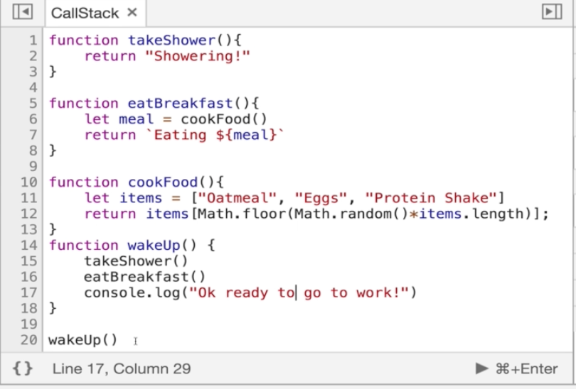

#### Why Use Recursion?

- What is recursion?
- A **process** (a function in our case)f that **calls itself**

###### Why Do I need To Know This?

- It's used everywhere
    - JSON.parse/JSON.stringify
    - document.getElementById
    - DOM traversal algorithms
    - Object traversal
    - It's sometimes a cleaner alternative to iteration

#### The Call Stack

- What happens behind the scenes when a function is calling itself over and over again
- In almost all programming languages, there is a built in data structure that manages what happens when functions are invoked
- In javascript this is called the `call stack`
    - It is a stack

###### The call stack

- Any time a function is invoked it is placed (**pushed**) on the top of the call stack
- When  JavaScript sees the return keyword or when the function ends, the compiler will remove (**pop**) the top item from the stack



```
1. wakeUp

2. takeShower
wakeUp

3. eatBreakfast 
wakeUp

4. cookFood
eatBreakfast
wakeUp

5. eatBreakfast
wakeUp

6. wakeUp

7. No more items left on call stack
```

###### Why do I care?

- You're used to functions being pushed on the call stack and popped off when they are done
- When we write recursive functions, we keep pushing new functions onto the call stack

#### Our First Recursive Functions Work

- Invoke the **same** function with a different input until you reach your base case

- Two things must be present
    1. There has to be a stopping point - *base case*
    2. Different input when you recursing - don't want to keep recursing with the same input (will get a call stack size exceeded error eventually)

###### Base Case

- The condition when the recursion ends

####### Example

```
function countDown(num) {
    if (num <= 0) {
        console.log('All done')
        return
    }
    console.log(num)
    num--
    countDown(num)
}

countDown(3) -> 3, 2, 1, All done!
```

-  Is num <= 0 is the *base case*
- Could also do the above example iteratively with a for loop

#### Second Recursive Function

```
function sumRange(num) {
    if (num ===1) return 1
    return num + sumRange(num -1)
}
```

- sumRange(4) = 10

- Base case is where num === 1
- Different intput is n - 1
- n keeps shrinking towards the base case

```
call sumRange(3)
    return 3 + sumRange(2)
        call sumRange(2)
            return 2 + sumRange(1)
                return 1
```

```
return 1
    return 2 + 1
        return 3 + 3
            return 6
```

*What the call stack looks like*

1. sumRange(4)

2. sumRange(3)
sumRange(4)

3. sumRange(2)
sumRange(3)
sumRange(4)

4. sumRange(1)
sumRange(2)
sumRange(3)
sumRange(4)

5. sumRange(2)
sumRange(3)
sumRange(4)

6. sumRange(3)
sumRange(4)

7. sumRange(4)

8. No items left in the call stack

#### Writing Factorial Recursively

- Classic recursion example
- Can be done iteratively as well

- Simple example with recursion
```
function factorial(num) {
    if (num === 1) return 1
    return num * factorial(num - 1)
}
```

###### Where things go wrong

- No base case or base case is wrong
- Returning the wrong thing (like forgetting to subtract 1 here) or forgetting to return in the first place
- Stack overflow

#### Helper Method Recursion

```
function outer(input) {
    let outerScopedVariable = []

    function helper(helperInput) {
        // modify the outerScopedVariable
        helper(helperInput--)
    }
    helper(input)
    return outerScopedVariable
}
```

- Have the outer function and then inside we have our recursive function
- helper calls itself
- Main outer function that we would call from outside and then inside the code of outer there is another function defined and it defines itself recursively
    - Done commonly when we want to compile data inside an array for example

###### Example

- Collecting all of the odd values in an array

```
function collectOddValues(arr) {

    let result = []

    function helper(helperInput) {
        if (helperInput.length === 0) {
            return
        }
        if (helpInput(0) % 2 !== 0) {
            result.push(helperInput[0])
        }
        helper(helperInput.slice(1))
    }

    helper(arr)

    return result

}
```

#### Pure Recursion

- Solving the same problem as above
- Collecting all of the odd values in an array

- Function itself is totally self-contained in its recursion
- Don't have an external data structure (like result array) or having a helper recursive method

```
function collectOddValues(arr) {
    let newArr = []

    if (arr.length === 0) {
        return newArr
    }

    if (arr[0] % 2 !== 0) {
        newArr.push(arr[0])
    }

    newArr = newArr.concat(collectOddValues(arr.slice(1)))
    return newArr
}
```

collectOddValues([1, 2, 3, 4, 5])

```
newArr = []
1 is odd
newArr = [1]
[1].concat(collectOddValues[2, 3, 4, 5])
    newArr = []
    2 is not odd
    newArr = []
    [].concat(collectOddValues([3, 4, 5]))
        newArr = []
        3 is odd
        [3].concat(collectOddValues[4, 5])
            newArr = []
            4 is even
            [].concat(collectOddValues[5])
                newArr = []
                5 is odd
                5.concat(collectOddValues[])
                5.concat([])

[1].concat(collectOddValues[2, 3, 4, 5])
    newArr = []
    2 is not odd
    newArr = []
    [].concat(collectOddValues([3, 4, 5]))
        newArr = []
        3 is odd
        [3].concat(collectOddValues[4, 5])
            newArr = []
            4 is even
            [].concat([5])
            return [5]

[1].concat(collectOddValues[2, 3, 4, 5])
    newArr = []
    2 is not odd
    newArr = []
    [].concat(collectOddValues([3, 4, 5]))
        newArr = []
        3 is odd
        [3].concat([5])
        return [3, 5]

[1].concat(collectOddValues[2, 3, 4, 5])
    newArr = []
    2 is not odd
    newArr = []
    [].concat([3, 5])
    return [3, 5]

[1].concat([3, 5])
return [1, 3, 5]
```

###### Pure Recursion Tips

- For arrays, use methods like slice, the spread operator, and concat that make copies of arrays so you do not mutate them

- Remember that strings are immutable so you will need to use methods like slice, substr, or substring to make copies of strings