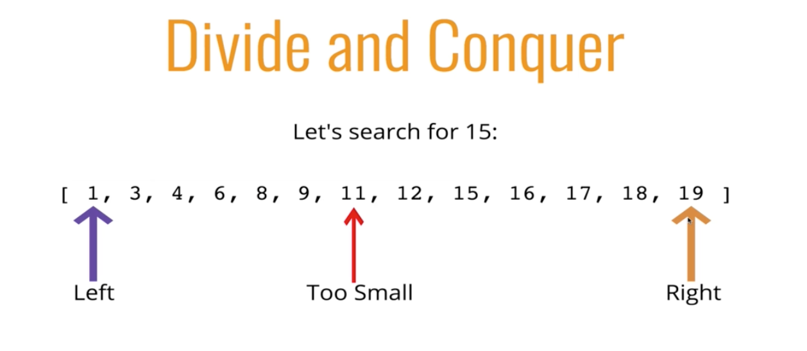
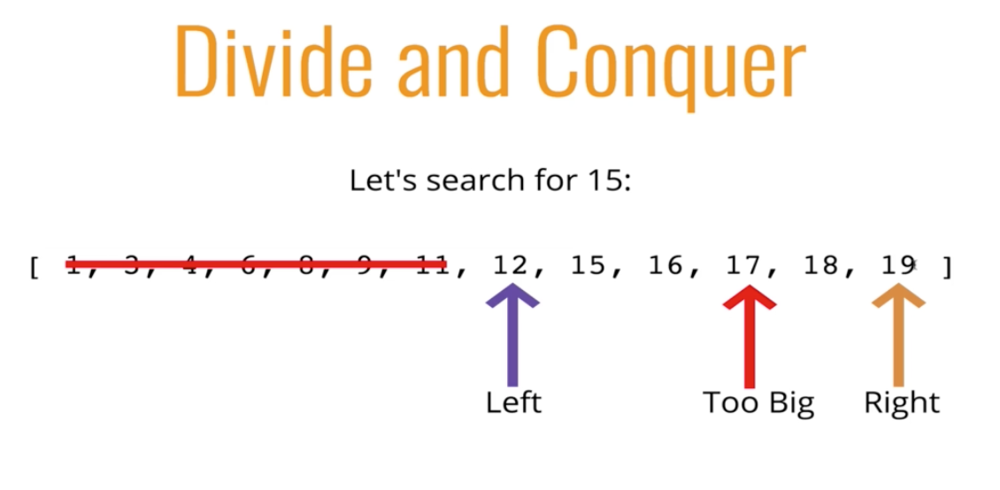
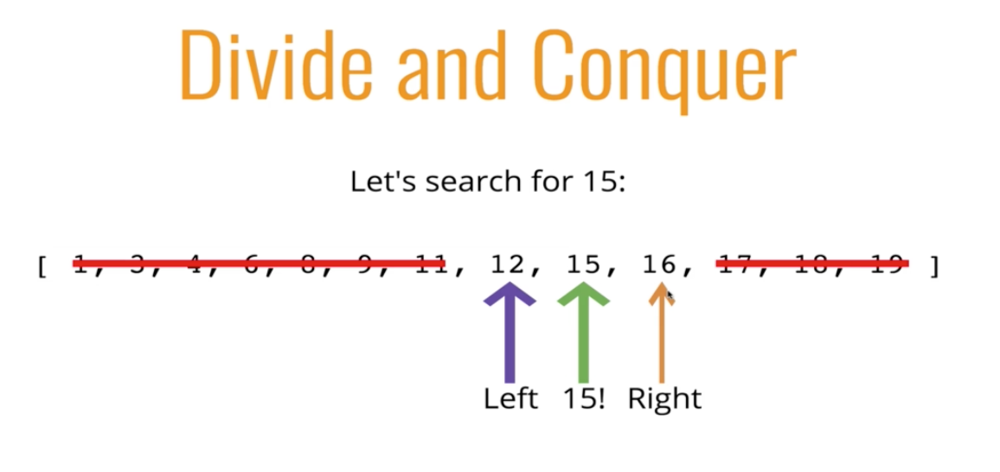
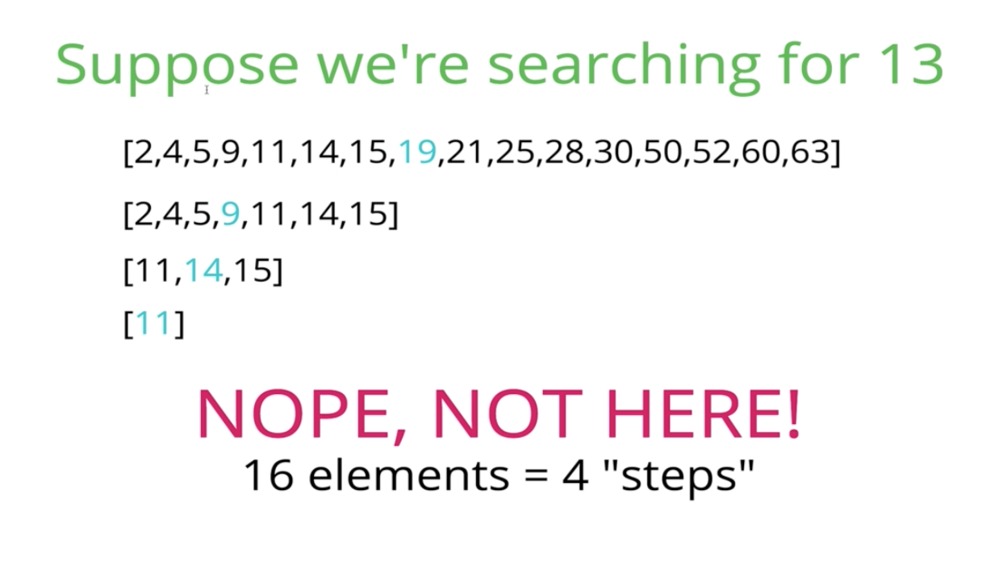
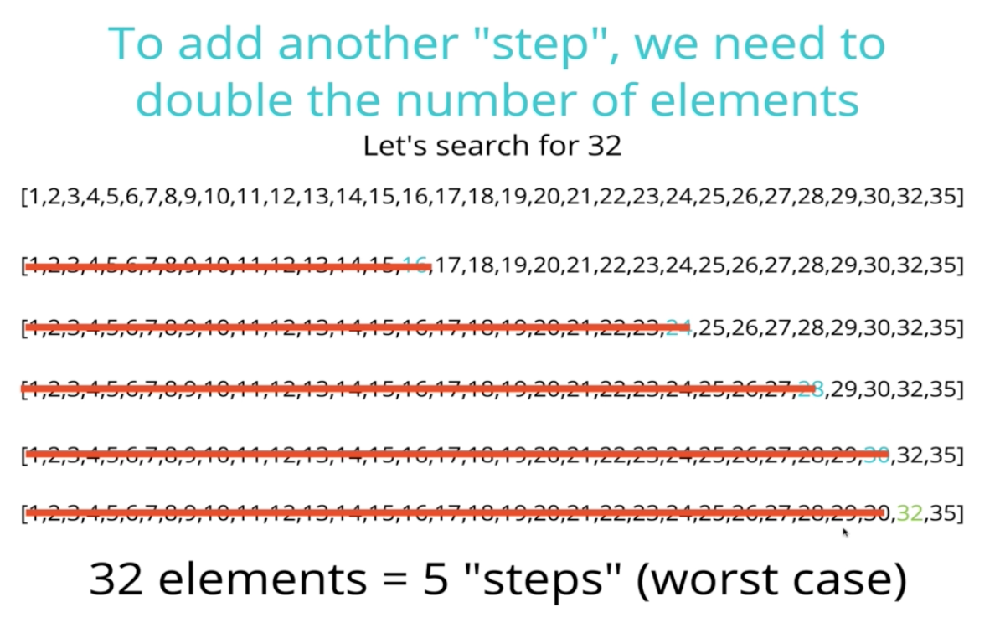

#### Intro to Linear Search

- How do we search?
- Given an array, the simplest way to search for a value is to look at every value in the array and check if it's the value we want
- This is linear search

###### JavaScript has search

- indexOf
- includes
- index
- findIndex

- they are checking every element one at a time

###### Linear Search

- Moving at a set interval - one item a time - checking every single thing

###### Linear Search Pseudocode

- This function accepts an array and a value
- Loop through the array and check if the current array element is equal to the value
- If it is, return the index at which the element is found
- If the value is never found, return -1

#### Linear Search Solution

- Big O?
- O(n) time

#### Linear Search Big O

- Best case O(1) - we find the thing we're looking for right away
- O(n) - worst case - the thing we are searching for is either the last item or not in there
- O(n) - average

#### Binary Search

- Must faster form of search
- Rather than eliminating one element at a time, you can eliminate half of the remaining elements at a time
- Only works on *sorted* arrays

###### Divide and Conquer

- Split the array into two pieces
- Split at the *pivot* point
- Check the left side and the right side and see in what half it will be

###### Binary Search PseudoCode

- This function accepts a sorted array and a value
- Create a left pointer at the start of the array, and a right pointer at the end of the array
- Get a middle point
- While the left pointer comes before the right pointer:
    - Is the element equal to the middle, return index
    - If too small, move left pointer up
    - If too large, move the right pointer up
    - If value not found, return -1

#### Binary Search Big O

- Worst and Average Case - O(logn)
- Best Case O(1)

- How do we get logn?

- 16 elements takes 4 steps, 32 takes 5 steps
- This relationship is log base 2 of n = log(n) -> which base assumed to be 2
    * 2^4 = 16
    * 2^5 = 32

#### String Search

- Suppose you want to count the number of times a smaller string appears in a longer string
- A straighforward approach involves checking pairs of characters individually

###### Naive Approach

*Pseudocode*

- Loop over the longer string, takes 2 strings 
- Loop over the shorter string
- If the characters don't match, break out of the inner loop
- If the characters do match
- If you complete the inner loop and find a match, incremement the count of matches
- Return the count
