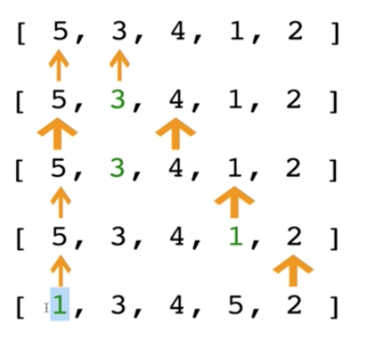

#### Intro

- Similar to bubble sort, but instead of first placing large values into sorted position, it places small values into sorted position

[5, 3, 4, 1, 2]

- Look for min value and put it at the front

Green = min

- Going through and selecting the smallest element, the min, and then putting it at the beginning

###### Selection Sort Pseudocode

- Store the element as the smallest value you've seen so far
- Comapre this item to the next item in the array until you find a smaller number - save the index of that value
- If a smaller nubmer is found, designate that samller number to be the new "minimum" and continu until the end of the array
- If the "minimum" is not the value (index) you initially began with, swap the two values
- Repeat this with the next element until the array is sorted

#### Big O Complexity

- time - O(n^2)
- If for some reason we're worried about writing to memory or we're worried about actually doing the swap - not very common
    * Selection sort is better than bubble sort in this case