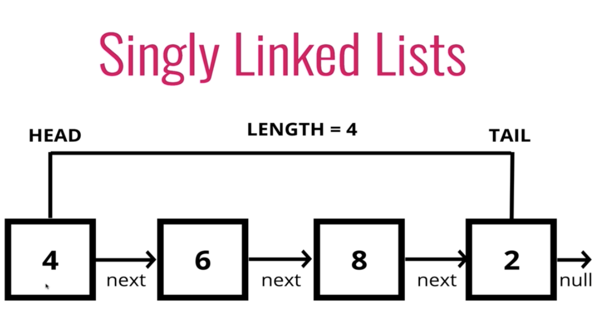
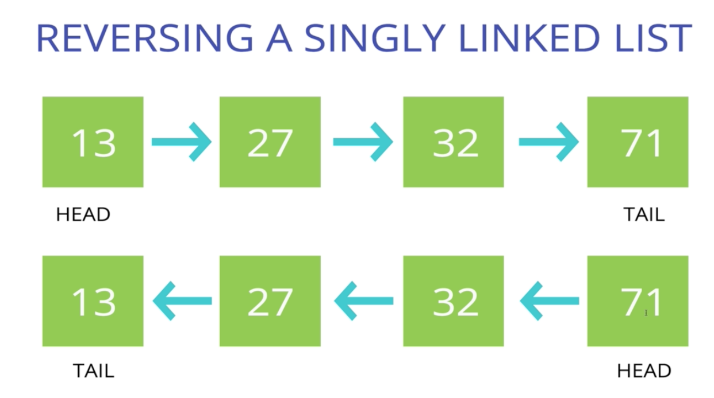

#### Intro

###### What is a linked list

- A data structure that contains a `head`, `tail`, and `length` property

- Linked Lists consist of `nodes`, and each `node` has a `value` and a `pointer` to another node or null
    * No indices
    * Each element just points to the next element
    * Like train cars
    * No "give me the 5th thing"

- The head is the beginning of the list
- The tail is the end (don't *have* to have this though)
- Don't keep track of every single item in the middles
- Keep track of the length as well

- Singly linked list comes from the fact that each node is only connected one directionally to the next node
- A doubly linked list also has a connection pointing back to the previous node

- It doesn't matter what the data is inside each node (an array could be contained inside of the node for example)

- If you want to search through the linked list - you have to go through each node 1 by 1 until you find it
- If you want to insert a node at position 4, you have to traverse the linke d list until you get to 3rd spot and node here after the 3rd one
- If you want to insert a new head, just make the new head and have it point to the old head and that's it
    * In an array, every single item would have to be reindexed

###### Comparisons with Arrays

**Lists**

- Don't have indices
- Connected via nodes with the **next** pointer
- Random access is not allowed

**Arrays**

- Indexed in order!
- Insertion and deletion can be expensive
- Can quickly be accessed at a specific index

- One of the reasons you would want to use Linked Lists over Arrays is if you really cared about insertion and deletion especially if you're working with a large data set

#### Push Intro

*Pushing pseudocode*

- This function should accept a value
- `Create a new node using the value passed to the function`
- If there is no head prop on the list, set the head and tail to be the newly created node
- Otherwise set the next property on the tail to be the new node and the tail property on the list to be the newly created node
- Incremement the length by 1

#### Popping

- `Removing a node from the end of the Linked List and returns it`
- The problem is to remove it we have to assign a new tail
- And that involves traversing the entire list from the beginning because we have no way of going backwards from the tail

*Popping pseudocode*

- If there are no nodes in the list, return undefined
- Loop through the list until you reach the tail
- Set the next property of the 2nd to last node to be null
- Decremement the length of the list by 1
- Return the value of the node removed

#### Shifting

- `Removing a head from the beginning of the Linked List`
- Takes constant time always

*Shifting Pseudocode*

- If there are no nodes, return undefined
- Store the current head property in a variable
- Set the head property to be the current head's next property
- Decrememnt the value by 1
- Return the value of the node removed

#### Unshifting

- `Adding a new node to the beginning of the Linked List`

*Unshifting Pseudocode*

- This function should accept a value
- Create a new node using the value passed to the function
- If there is no head property on the list, set the head and tail to be the newly created node
- Otherwise set the newly created node's next property to be the current head property on the list
- Set the head property on the list to be that newly created node
- Increment the length of the list by 1
- Return the linked list

#### Get

- Retrieving a ndoe by it's position in the Linked List
- Takes a number and returns the item at the position (starting from 0)
    * Have to traverse the list

*Get pseudocode*

- This function should accept an index
- If the index is less than zero or greater than or equal to the length of the list, return null
- Loop through the list until you reach the index and return the node at that specific index

#### Set

- Changing the value of a node based on it's position in the Linked List
- Accepts a position/index and a value to update the item

*Set Pseudocode*

- This should should accept a value and an index
- Use your **get** function to find the specific node
- If the node is not found, return false
- If the node is found, set the value of that node to be the value passed to the function and return true

#### Insert

- Adding a node to the Linked List at a specific position
- Takes index and a value

- Inserts a new node at whatever position we specify

*Insert pseudocode*

- If the idnex is less than zero or greater than the length, return false
- If the index is the same as the length, push a new node to the end of the list
- If index is 0, unshift a new node to the start of the list
- Otherwise, using the **get** method, access the node at the index - 1
- Point the next property on the previous node to be the new node
- Connect the new node to the old next node
- Increment the length
- Return true

#### Remove

- Removing a node from the Linked List at a **specific** position
- Takes in an index and removes the value at that index and patches up that hole in the Linked List

*Remove Pseudocode*

- If the index is less than or greater than the length, return undefined
- If the index is the same as the length - 1, pop
- If the index is 0, use shift
- Otherwise, use the **get** method, access the node at the index - 1
- Set the next property on that node to be the next of the next ndoe
- Decrement the lenght
- Return the value of the node removed

#### Reverse

- Reversing the Linked List **in place**
- So no copy is created

*Reverse Pseudocode*

- Swap head and tail
- Create a variable called next
- Create a variable called prev
- Create a variable called node and initialize it to the head property
- Loop through the list
- Set next to be th enext property on whatever node is
- Set the next property on the node to be whatever prev is
- Set prev to be the value of the node variable
- Set the node variable to be the value of the next variable

#### Big O of Singly Linked Lists

- Insertion at beginning or end - O(1)
- Removal - it depends...O(1) or O(n)
    * From beginning it's O(1)
    * If you're popping it's O(n) because you have to iterate through the SLL
- Searching - O(n)
    * Array is O(n) as well
- Access - O(n)
    * Array access is O(1)

###### Recap

- SLLs are an excellent alternative to arrays when insertion and deletion at the beginning are frequently required
- Arrays contain a built in index whereas Linked Lists do not
- `The idea of a list data structure that consists of nodes is the foundation for other data structures like Stacks and Queues`