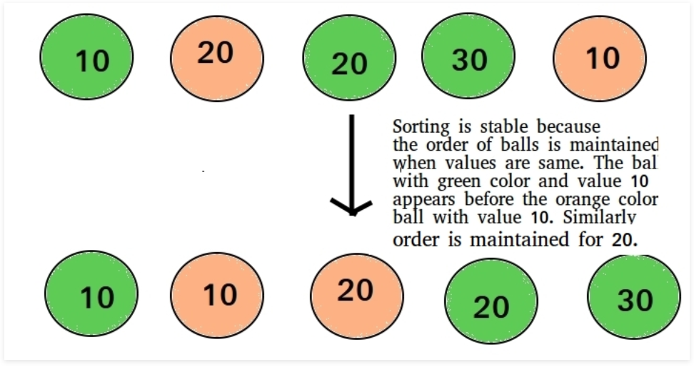

https://www.geeksforgeeks.org/sorting-terminology/

###### What is in-place sorting?

- `An in-place sorting algorithm uses constant space for producing output (only modified the given array only)`
- It sorts the list only by modifying the order of the elements within the list
- For example, InsertionSort and SelectionSort are in-place sorting algorithms as they do not use any additional space for sorting the list and a typical implementation of MergeSort is not in-place, also the implementation for CountingSort is not an in-place sorting algorithm

###### What are Internal and External Sortings

- When all data that needs to be sorted cannot be placed in-memory at a time, the sorting is called `external sorting`
- External sorting is used for massive amounts of data
- MergeSort and its variations are typically used for external sorting
- Some examples of external storage are the hard-disk, CD, etc
- `When all data is placed in-memory, then sorting is called internal sorting`


https://www.geeksforgeeks.org/stability-in-sorting-algorithms/
###### What is stable sorting?

- A sorting algorithm is said to be stable if two objects with equal keys appear in the same order in sorted output as they appear in the input array to be sorted

- Formally, stability may be defined as

```
Let A be an array, and let < be a strict weak ordering on the elements of A
A sorting algorithm is stable if 
i < j and A[i] = A[j] implies pi(i) < pi(j)
where pi is the sorting permutation (sorting moves A[i] to position pi(i))
```

- Informally, stability means that equivalent elements retain their relative positions after sorting


###### Which sorting algorithms are srtable

- Some are stable by nature such as BubbleSort, InsertionSort, MergeSort, and CountSort

###### Which sorting algorithms are unstable

- QuickSort, HeapSort are not stable by default but can be made stable by also taking the position of the elements into consideration
- THis change may be done in a way which does not compromise a lot on performance but may take some extra space (possibly O(n))
