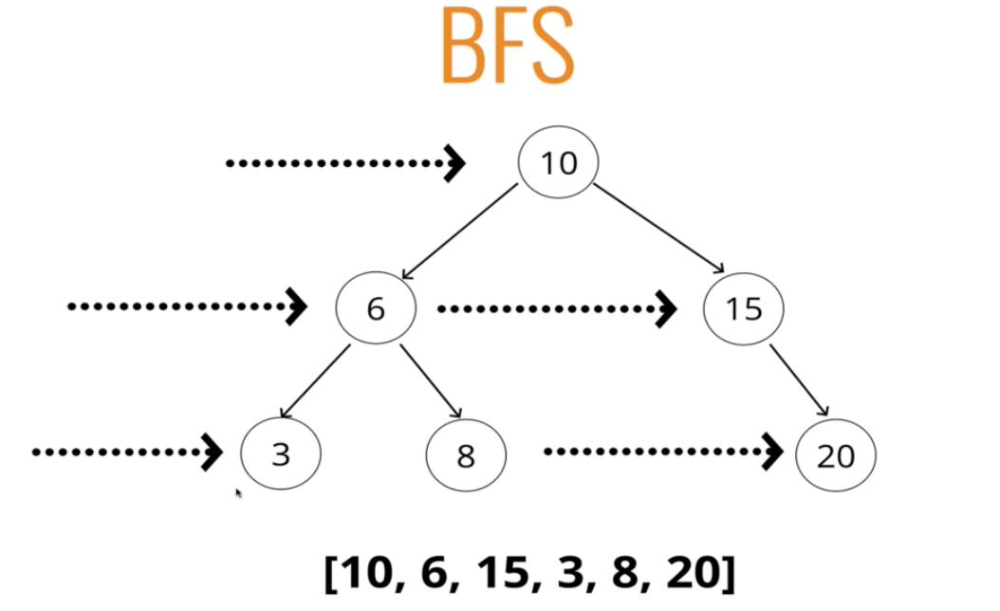

#### Intro

- Given any tree, how do we visit every node once?
- With a LL it is very easy, you just follow the next property

###### Traversing a tree

- Breadth First Search (BFS)

- Depth First Search (DFS)
    * 3 main orders for this
    * InOrder
    * PreOrder
    * PostOrder

#### Breadth First Search (BFS)

- We want to visit every node on the same level before we look at a child

- Why use this versus another one?

###### Implementing BFS

**Steps - Iteratively**

- Create a queue (this can be an array) and a variable to store the values of nodes visited
- Place the root node in the queue
- Loop as long as there is anything in the queue
    * Dequeue a node from the queue and push the value of the node into the variable that stores the nodes
    * if there is a left property on the node dequeued - add it to the queue
    * If there is a right property on the node dequeued - add it to the queue

  10
 6     15
3  8     20

queue [10]
visited []

queue [6, 15]
visited [10]

queue [15, 3, 8]
visited [10, 6]

queue [3, 8, 20]
visited [10, 6, 15]

queue [8, 20]
visited [10, 6, 15, 3]

queue [20]
visited [10, 6, 15, 3, 8]

queue []
visited [10, 6, 15, 3, 8, 20]

Queue is now empty so we are done and we return visited

#### Depth First Search (DFS) PreOrder Intro

- Going to visit the node first then we look at the entire left side and then we traverse the right
-

Start off with 10

[10]

[10, 6]

[10, 6, 3]

[10, 6, 3, 8]

[10, 6, 3, 8 15]

[10, 6, 3, 8, 15, 20]

*DFS PreOrder*

- Create a variable to store the values of nodes visited
- Store the root of the BST in a variable called current
- Write a helper function which accepts a node
    * Push the value of the node to the variable that stores the values
    * If the node has a left property, call the helper function with the left property on the node
    * If the node has a right property, call the helper function with the right property on the node

#### DFS - PostOrder

- Start at 10, go all the way to the left (6), go to 3 and then 8 and then add 6 in

[3]
[3, 8]
[3, 8, 6]
[3, 8, 6, 20]
[3, 8, 6, 20, 15]
[3, 8, 6, 20, 15, 10]

- The route is the last thing that is visited in this search
- For any node, we explore all children before we visit the actual node

*DFS - PostOrder*

- Create a variable to store the values of nodes visited
- Store the BST in a variable called current
- Write a helper function which accepts a node
    * If the node has a left property, call the helper function with the left property on the node
    * If the node has a right property, call the helper function with the right property on the node
    * Push the value of the node to the variable that stores the values
- Invoke the helper function with the current variable

#### DFS - InOrder

[3]
[3, 6]
[3, 6, 8]
[3, 6, 8, 10]
[3, 6, 8, 10, 15]
[3, 6, 8, 10, 15, 20]

*DFS - InOrder*

- Create a variable to store the values of nodes visited
- Store the BST in a variable called current
- Write a helper function which accepts a node
    * If the node has a left property, call the helper function with the left property on the node
    * Push the value of the node to the variable that stores the values
    * If the node has a right property, call the helper function with the right property on the node
- Invoke the helper function with the current variable

#### When to Use BFS and DFS

- Depends on the tree
    * If you have a tree that is fully fleshed out 
    * Queue can grow very very quickly - this is just storing data in memory with BFS
    * With DFS, we're not storing all of those nodes across the tree
        - We only have to keep track of the nodes in a given branch all the way down to the end

- In DFS search each node colored in red is a frame on the call stack

- In the sort of above tree where it's a lot wider than it is deep, then DFS would use less *space*
    - Same amount of time

- In this sort of tree (which doesn't make sense as a tree), BFS uses almost no space - it will only ever have 1 item in the queue

- Time complexity is the same between BFS and DFS
- Space complexity - it depends
    * For very wide tree - BFS could take up more space
    * For very deep tree - DFS could take up more space

###### Different variants of DFS

- PreOrder, PostOrder, InOrder

- Why use one over the other?
- Not a lot of good examples
- When you use in order on a BST, you get the data back in ascending order - goes from lowest to highest
    * This could be useful
- PreOrder can be used to "export" a tree structure so that it can easily be reconstructed or copied

###### Recap

- Trees are non-linear data structures that contain a root and parent nodes
- Binary trees can have value of any type, but at most two children for each parent
- BSTs are a more specific version of binary trees where every node to the left of a parent is less than it's parent value and every node to the right is greater than it's parent value