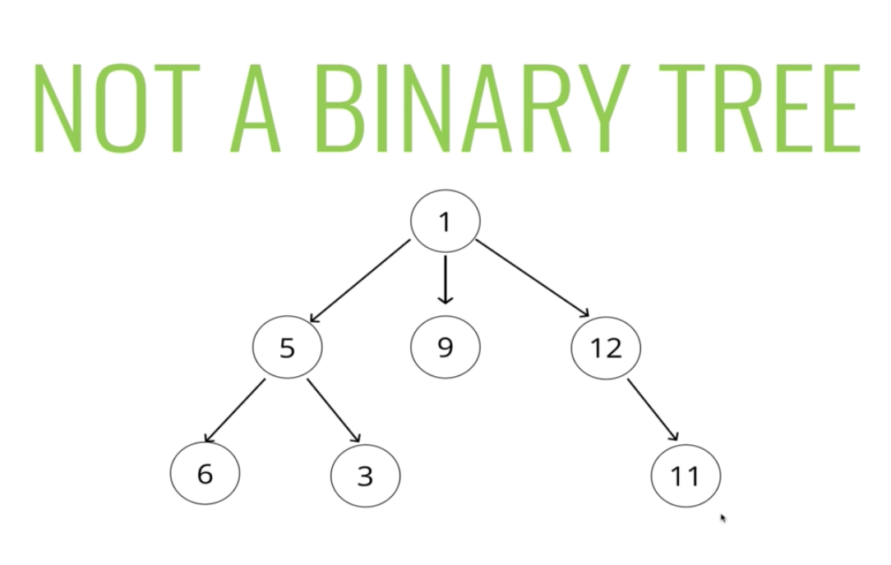

#### Introduction

- A classic data structure
- Very commonly used and taught

###### What is a tree?

- A data structure that consists of nodes in a **parent/child** relationship
- This creates a branching structure

- Each circle is called a *node*
- The top most circle is called the *root*
- Each node can point to more than one node

- Can be like above, it doesn't have to be like the other image
- Trees are *nonlinear* - Lists are *linear*

- A SLL is a sort of a special case of a tree

###### Some rules

- This is actually a graph
- Every node has to be moving away from the root node in a tree

- Two roots - so not a tree

###### Tree Terminology

- **Root** - The top node in a tree
- **Child** - A node directly connected to another node when moving away from the Root
- **Parent** - The converse notion of a child
- **Siblings** - A group of nodes with the same parent
- **Left** - A node with no children
- **Edge** - The connection between one node and another

#### Uses for Trees

Lots of different applications

- Most common example is HTML and DOM (document object model)
- Network Routing
- Abstract Syntax Tree
    * People use this if you were writing code to take in a other code and run that code or to parse that code or to make sure it's valid syntax you could use this

- AI/ML
    * Simplest example is called a minimax tree (*The Decision Tree*)
    * Want to build an AI that is very good, that isn't just making random moves
    * Could basically break down the logic of the game into a tree
      - Basically it says here is a given state of the baord and these are all the possible moves that the human player could make with them

- Computer file systems

- JSON

#### Into to Binary Trees

###### Kinds of Trees

- Trees
- Binary Trees
- Binary Search Trees
    * Special type of a binary tree which is a special type of a tree
    * They excel at searching

###### Binary Trees

- Each node can have at most two children
    * 0, 1, or 2 children
    * Root node usually has 2

###### Binary Search Trees

- Have at most two children per node
- BSTs are sorted in a particular way
- Used to store data that can be compared, that is sortable
    * Numbers in a classical sense, but it could be anything you can do a comparison on
- If we take any node on the true, all nodes that are less than that item are located to the left
    * Any number greater is located to the right
    * This can be repeated on the children node

###### How BSTs Work

- Every parent node has at most **two** children
- Every node to the left of a parent node is **always less** than the parent
- Every node to the right of a parent node is **always greater** than the parent

#### Searching a BST

- The way we order things makes it easier to insert and look up
- Much faster than an unsorted tree

- Every comparison we do should roughly chop the tree in half
    * Could end up having a lot more values on one side, but this is just generally speaking for the above
- If you were looking in an unsorted tree, you would potentially have to traverse the entire tree to find it

#### Our Tree Classes

#### Inserting

###### Inserting a Node

**Steps - Iteratively or Recursively**

- Create a new node
- Starting at the root
    * Check if there is a root, if not - the root now becomes the new node
    * If there is a root, check if the value of the new node is greater than or less than the value of the root
    * If it is greater
        - Check to see if there is a node to the right
            * If there is, move that node and repeat these steps
            * If there is not,a dd that node as the right property
    * If it is less
        - Check to see if there is a node to the left
            * If there is, move to that node and repeat these steps
            * If there is not, add tha tndoe as the left property
- Return the entire tree at the end

- What to do with duplicate values?
    * Could keep track of them in the node themselves
        - 10 has been inserted twice for instance
    * Ignore them outright

#### Find

- Starting at the root
    * Check if there is a root, if not - we're done searching
    * If there is a root, check if the value of the new node is the value we are looking for, if we find it we are done
    * If not, check to see if the value is greater than or less than the value of the root
    * If it is greater
        * Check to see if there is a node to the right
            - If there is, move to that node and repeat these steps
            - If there is not, we're done searching
    * If it is less
        - Check to se if there is a node to the left
            - If there is, move to that node and repeat these steps
            - IF there is not, we're done searching

#### Big O of BST

- Insertion - O(logn)
- Searching - O(logn)
    * This is *best* and *average* case
    * This is not guaranteed

-  As the number of nodes double, we only increase the number of steps by 1

- THIS IS NOT WORST CASE

- This is a valid BST
- This just looks like a SLL
- Searching and Inserting here is O(n)

- There are solutions to this problem
- If you want to keep the BST structure, use something like `34` as the root